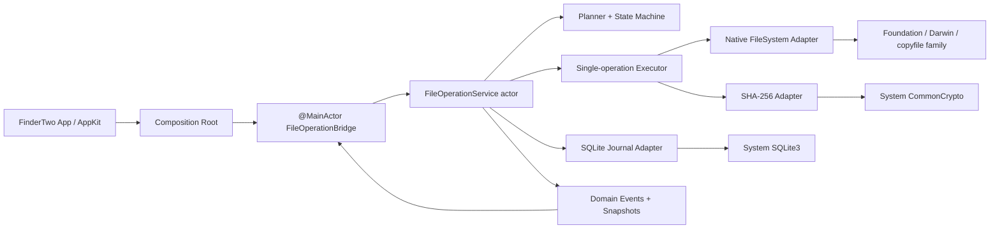
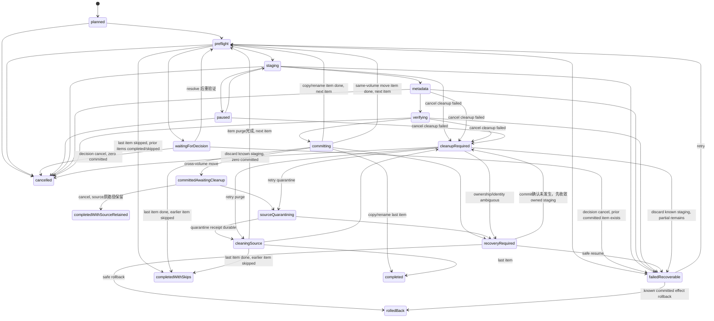
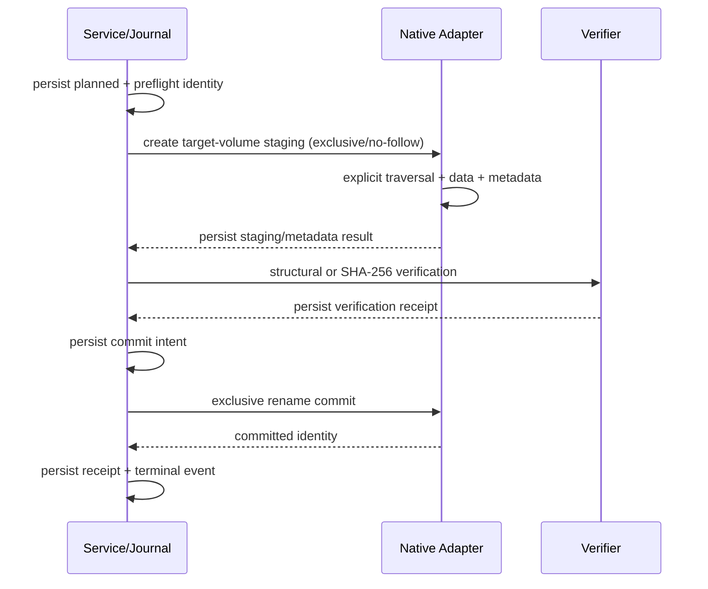
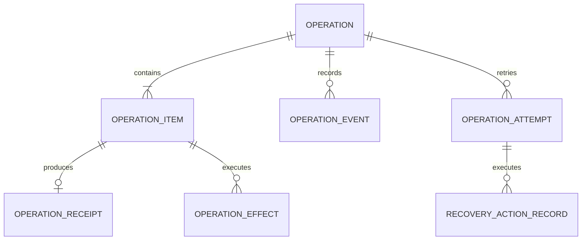
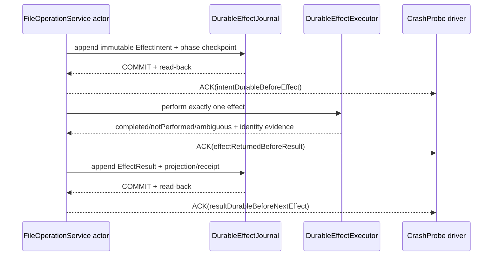

## Context

### 当前证据与问题边界

本 change 基于 2026-07-21 的本地 `main` 快照设计，不把 `TECHDEBT.md` 的自评当作验收结论。已验证事实、合理推断和未知项如下：

| 分类 | 结论 | 证据/后续验证 |
|---|---|---|
| 已验证事实 | SwiftPM 只有 `FinderTwo` executable target，无 library/test target。 | `Package.swift:7-20` |
| 已验证事实 | `TransferQueue` 是 singleton，worker 在跨卷路径 copy 成功后 best-effort 删除 source；手写 copy 直接创建 final path，写异常不清 partial，只 best-effort 保留 mode/mtime；tree 枚举失败被折叠为空数组。 | `Sources/FinderTwo/Model/TransferQueue.swift:117,212-240,293-333` |
| 已验证事实 | Replace 在 enqueue 前用 `try?` 把旧 destination 移入 Trash；旧目标没有进入 TransferQueue receipt。 | `Sources/FinderTwo/FS/FileOps.swift:193-221` |
| 已验证事实 | Transfer worker 回调 `FileOps.mergeDirectory`，size 计算引用 UI 的 `FileListController`；Core/UI 依赖方向尚未形成。 | `TransferQueue.swift:223,349-352` |
| 已验证事实 | Undo/redo 是内存 closure，无法跨重启审计和恢复。 | `Sources/FinderTwo/Model/FileActionLog.swift:7-38` |
| 已验证事实 | TestRunner/DemoShot 由 App 环境变量触发且编入同一 executable；现有 GUI 脚本只验证菜单结构。 | `Sources/FinderTwo/AppDelegate.swift:53-91`；`guitest.sh:8-35` |
| 已验证事实 | `build.sh` 在 `set -euo pipefail` 下直接执行证书查询 pipeline；无本地证书时会在 ad-hoc 分支前退出。 | `build.sh:4,47-53`；本轮既有实测 exit 44 |
| 合理推断 | 当前弱 metadata、直接 final-path write、忽略枚举/删除错误可造成数据语义丢失、partial 或错误 completed。 | 必须由 M1/M2 fault tests 与真实卷 manifest 证实每个具体场景。 |
| 未知 | macOS 13 及 APFS/ExFAT/SMB/File Provider 对 exclusive/swap rename、metadata、sparse、hard link、fsync 的实际组合保证。 | 只能由对应 OS/真实卷 lane 授权 capability；未验证即禁用。 |
| 未知 | 进程崩溃之外的 OS crash/power-loss 状态集合。 | M3 SIGKILL 只证明 process-crash；power-loss 留作 M8 release/manual lane。 |

当前生产源码至少存在 15 个直接用户内容 mutation 文件及多组外部进程副作用。M1 的 inventory 必须分为：`core-authorized`、`legacy-user-content`、`app-state`、`external-nontransactional`、`test-demo`。Archive、SFTP download、原地图片 rotate 虽由系统进程执行，仍是 user-content mutation，不能借 external 分类绕过 gate。

### 利益相关者与约束

- 用户需要 Finder 级数据安全，而不是“多数情况下复制成功”。任何不确定恢复都必须停在 `recoveryRequired`。
- App/UI 尽量保留；M1/M2 是可证伪实验，不预设渐进迁移一定成功。
- macOS 最低版本保持 13；只使用 Swift、Foundation、Apple/POSIX 与系统库，不引入第三方运行时。
- M0–M4 冻结 upstream merge；每个里程碑结束由主 Codex亲跑验收、独立 reviewer 审查、用户批准后再继续。
- 本 change 不授权 commit、push、PR、OpenSpec sync/archive、发布或部署。

## Goals / Non-Goals

**Goals:**

- 建立 App → bridge → Core 的单向依赖和无 AppKit 的可测试 domain。
- 让 copy/move/replace 的磁盘真实状态、journal、event、snapshot 与 UI 语义一致。
- 在 commit 前保持 final destination/旧目标不变；跨卷 move 在完整验证和 durable commit 后才允许删除 source。
- 对 metadata、volume/provider 能力、竞态、取消、失败和崩溃采用 fail-closed 策略。
- 用 M1/M2 的二元 Go/No-go 及时判断是否应改为扩大同仓库重写或新仓库重写。

**Non-Goals:**

- M0 不修改生产代码；M1–M4 不迁移 Merge、Trash/Undo、FolderSync、Batch Rename、Archive、SFTP、QuickActions 或其他 M5+ 能力。
- 不把 app preference/theme persistence、用户主动执行的 Terminal/Shortcut 伪装成文件事务。
- 不承诺跨整个多 item operation 的全局原子性；第一版保证单 item commit，并准确报告已提交子集。
- 不从新 SDK 头文件推导所有旧 OS/目标卷行为；未知 capability 不上线。
- 不复制、逐行翻译或 AI 改写 Nimble Commander 的 GPL 实现。Nimble 只作为行为/错误/测试 oracle；实现依据 Apple/POSIX 公共 API 独立完成。

## Architecture



依赖规则：

- `Sources/RascalFileOperations/Core/**` 的 domain 层只允许 Swift 标准库、Foundation/Darwin；不得 import AppKit、SQLite3、CommonCrypto 或 FinderTwo 类型。
- 同一 library target 内的 `Native/**`、`Journal/**` adapter 可分别 import 系统 `SQLite3`、`CommonCrypto`、Darwin/Foundation。整个产品依赖 allowlist 是 Foundation、Darwin、SQLite3、CommonCrypto；第三方 runtime 为零。
- App 只在一个 composition root 构造 service/bridge；Pane、Window、FileList 不得各自创建 service 或新增 singleton。
- Native data copy 在专用串行执行上下文运行，callback 读取线程安全 pause/cancel control；actor 不同步阻塞在 `copyfile`，仍可响应 snapshot/control。

## Public Contract

### 服务

固定入口保持如下：

```swift
public actor FileOperationService {
    public init(configuration: ServiceConfiguration = .default) throws
    public func submit(_ request: OperationRequest) async throws -> OperationID
    public func snapshot(_ id: OperationID) async throws -> OperationSnapshot
    public func events() -> AsyncStream<OperationEvent>
    public func resolve(_ token: DecisionToken, with decision: OperationDecision) async throws
    public func pause(_ id: OperationID) async
    public func resume(_ id: OperationID) async
    public func cancel(_ id: OperationID) async
    public func retry(_ id: OperationID) async throws
    public func recover(_ id: OperationID, action: RecoveryAction) async throws
}
```

`ServiceConfiguration.default`固定指向Application Support live journal factory seam。M1提供可编译的`UnavailableOperationJournal` production placeholder，默认initializer因此只进入明确safe mode；M3在精确wiring allowlist内把factory切到SQLite adapter。Test target通过`@testable` internal dependency initializer注入fake/ephemeral adapter；production公开API不得选择ephemeral。M2新增package-internal `VolatileOperationJournal`，只允许在`#if DEBUG`且环境变量精确为`RASCAL_ENABLE_M2_NATIVE_COPY=1`时由唯一composition root构造；它只提供当前进程内的event/receipt一致性，不声明restart、crash或durability跨进程保证。`FT_RUN_TESTS`、`FT_DEMO`或legacy gate均不得隐式授予该能力。Release无论环境变量为何都继续使用unavailable graph并在submit前拒绝；M3再替换为SQLite，不把live journal提前到M2。`submit`只有在request已校验且当前journal的`.planned` intent成功persist后才返回ID；返回ID不代表完成。Service初始化若无法安全打开/校验journal或取得process owner lock，则进入service-wide read-only safe mode。

`pause/resume/cancel`的签名按已锁定接口不抛错：已知ID的非法阶段在该operation下记录durable `controlRejected`；unknown ID只能产生transient service diagnostic，不能伪造带FK/sequence的event。重复控制无副作用。`recover`凭ActionID/expected sequence实现command幂等；`retry(OperationID)`受固定签名限制，只承诺filesystem-effect幂等，不承诺跨新failure epoch的at-most-once。每个attempt/effect仍必须由ledger、receipt和identity防止重复覆盖或删除。

### 规范性公共类型附录

以下是M1必须冻结的字段/case；可以拆分文件或使用自定义Codable实现，但语义、case和schema version不得由worker自行改变：

```swift
public struct OperationID: RawRepresentable, Hashable, Codable, Sendable {
    public let rawValue: UUID
    public init(rawValue: UUID)
}
public struct OperationItemID: RawRepresentable, Hashable, Codable, Sendable {
    public let rawValue: UUID
    public init(rawValue: UUID)
}
public typealias EventSequence = UInt64

public enum OperationKind: String, Codable, Sendable {
    case copy, move, rename, replace, merge, trash, create
}
public enum DestinationMode: String, Codable, Sendable {
    case container, exact, exactDirectory
}
public enum ConflictPolicy: String, Codable, Sendable {
    case ask, skip, keepBoth, replace, merge, stop
}
public enum VerificationPolicy: String, Codable, Sendable {
    case structural, sha256
}
public enum CreateDescriptor: Codable, Sendable, Equatable {
    case file(initialContents: Data?)
    case directory
    case symbolicLink(target: String)
}
public enum MetadataField: String, Codable, Sendable, Hashable, CaseIterable {
    case posixMode, modificationTime, creationTime, addedTime
    case extendedAttributes, finderInfo, finderTags, resourceFork, acl
    case bsdFlags, symlinkMetadata, hardLinkTopology, sparseTopology
}
public struct PortableApproval: Codable, Sendable, Hashable {
    public let decisionID: UUID
    public let approvedLosses: Set<MetadataField>
    // public memberwise init intentionally unavailable; only resolve() creates it.
}
public enum MetadataPolicy: Codable, Sendable, Equatable {
    case finderCompatible
    case portable(PortableApproval)
}
public struct OperationRequest: Codable, Sendable {
    public let schemaVersion: UInt16
    public let kind: OperationKind
    public let sources: [URL]
    public let destination: URL?
    public let destinationMode: DestinationMode?
    public let createDescriptor: CreateDescriptor?
    public let conflictPolicy: ConflictPolicy
    public let metadataPolicy: MetadataPolicy
    public let verificationPolicy: VerificationPolicy
    public init(
        kind: OperationKind,
        sources: [URL],
        destination: URL?,
        destinationMode: DestinationMode?,
        createDescriptor: CreateDescriptor? = nil,
        conflictPolicy: ConflictPolicy = .ask,
        metadataPolicy: MetadataPolicy = .finderCompatible,
        verificationPolicy: VerificationPolicy = .structural
    )
}

public enum OperationState: String, Codable, Sendable {
    case planned, preflight, waitingForDecision, staging, paused, metadata, verifying
    case committing, committedAwaitingCleanup, sourceQuarantining, cleaningSource
    case completed, completedWithSkips, completedWithSourceRetained, cancelled
    case failedRecoverable, recoveryRequired, cleanupRequired, rolledBack
}
public enum OperationItemState: String, Codable, Sendable {
    case pending, preflight, waitingForDecision, staging, paused, metadata, verifying
    case committing, committed, committedAwaitingCleanup, sourceQuarantining
    case cleaningSource, completed, skipped, cancelled
    case failedRecoverable, recoveryRequired, cleanupRequired, rolledBack
}
public struct OperationProgress: Codable, Sendable, Equatable {
    public let bytesCompleted: Int64
    public let bytesTotal: Int64?
    public let itemsCompleted: Int
    public let itemsTotal: Int
}
public struct MetadataOutcome: Codable, Sendable, Equatable {
    public let preserved: Set<MetadataField>
    public let degraded: Set<MetadataField>
    public let unknown: Set<MetadataField>
}
public struct VerificationOutcome: Codable, Sendable, Equatable {
    public let policy: VerificationPolicy
    public let sourceDigest: String?
    public let stagedDigest: String?
    public let manifestDigest: String
}
public struct OperationReceiptSummary: Codable, Sendable, Equatable {
    public let committedIdentityDigest: String
    public let backupURL: URL?
    public let quarantineURL: URL?
    public let sourceCleanupPending: Bool
}
public struct OperationItemSnapshot: Codable, Sendable {
    public let id: OperationItemID
    public let source: URL
    public let destination: URL?
    public let state: OperationItemState
    public let progress: OperationProgress
    public let metadata: MetadataOutcome?
    public let verification: VerificationOutcome?
    public let receipt: OperationReceiptSummary?
    public let failure: FileOperationFailure?
}
public struct OperationSnapshot: Codable, Sendable {
    public let schemaVersion: UInt16
    public let id: OperationID
    public let kind: OperationKind
    public let state: OperationState
    public let latestSequence: EventSequence
    public let request: OperationRequest
    public let effectiveMetadataPolicy: MetadataPolicy
    public let effectiveVerificationPolicy: VerificationPolicy
    public let progress: OperationProgress
    public let items: [OperationItemSnapshot]
    public let pendingDecision: DecisionRequest?
    public let terminalFailure: FileOperationFailure?
    public let availableActions: [RecoveryAction]
    public let hasPartialCommit: Bool
    public let sourceRetained: Bool
}

public struct DecisionToken: RawRepresentable, Hashable, Codable, Sendable {
    public let rawValue: UUID
    public init(rawValue: UUID)
}
public enum DecisionScope: String, Codable, Sendable, Equatable { case item, remainingItems }
public enum OperationDecision: Codable, Sendable, Equatable {
    case skip(scope: DecisionScope)
    case keepBoth(scope: DecisionScope)
    case replace(scope: DecisionScope)
    case merge(scope: DecisionScope)
    case stop
    case approvePortable(losses: Set<MetadataField>, scope: DecisionScope)
    case cancel
}
public struct DecisionRequest: Codable, Sendable {
    public let token: DecisionToken
    public let operationID: OperationID
    public let itemID: OperationItemID
    public let expectedSequence: EventSequence
    public let allowed: [OperationDecision]
    public let metadataLosses: Set<MetadataField>
    public let identityDigest: String
}

public struct RecoveryCommand: Codable, Sendable, Hashable {
    public let actionID: UUID
    public let expectedSequence: EventSequence
}
public enum RecoveryAction: Codable, Sendable, Hashable {
    case resumeFromVerifiedStage(RecoveryCommand)
    case retrySourceCleanup(RecoveryCommand)
    case retainSource(RecoveryCommand)
    case rollbackCommittedDestination(RecoveryCommand)
    case restoreBackup(RecoveryCommand)
    case finalizeKnownCommit(RecoveryCommand)
    case discardKnownStaging(RecoveryCommand)
}
public enum FileOperationErrorCode: String, Codable, Sendable {
    case validation, featureDisabled, sourceChanged, destinationChanged
    case permissionDenied, noSpace, volumeDisconnected, unsupportedMetadata
    case verificationMismatch, partialCommit, journalFailure, recoveryRequired
    case controlRejected, decisionExpired, invariantViolation, serviceSafeMode
}
public struct FileOperationFailure: Error, Codable, Sendable {
    public let code: FileOperationErrorCode
    public let operationID: OperationID?
    public let itemID: OperationItemID?
    public let phase: OperationState?
    public let systemCode: Int32?
    public let diagnostic: String
    public let retryable: Bool
}

public enum EventDurability: String, Codable, Sendable { case durable, transient }
public enum OperationEventPayload: Codable, Sendable {
    case admitted(OperationSnapshot)
    case stateChanged(from: OperationState, to: OperationState)
    case itemStateChanged(from: OperationItemState, to: OperationItemState)
    case progress(OperationProgress)
    case decisionRequired(DecisionRequest)
    case decisionResolved(DecisionToken)
    case failure(FileOperationFailure)
    case receiptRecorded(OperationReceiptSummary)
    case recoveryAvailable([RecoveryAction])
    case recoveryConverged(completedActionID: UUID, availableActions: [RecoveryAction])
    case completed(OperationSnapshot)
}
public struct OperationEvent: Codable, Sendable {
    public let operationID: OperationID
    public let itemID: OperationItemID?
    public let sequence: EventSequence
    public let timestamp: Date
    public let durability: EventDurability
    public let payload: OperationEventPayload
}

public struct ServiceConfiguration: Sendable {
    public static let `default`: ServiceConfiguration
    public let journalURL: URL
}
```

`admitted`必须与`.planned` snapshot、`submissionOrdinal`和sequence 1在同一journal admission事务中durable persist；它是排队operation在尚未成为active之前的replay发现记录。折叠器以其snapshot初始化projection，并把latest durable sequence设为该事件sequence。`recoveryConverged`必须与completed ActionID、旧capability失效及完整后继`availableActions`在同一durable checkpoint中提交；折叠器移除已完成action并以payload中的完整列表替换可用动作，新动作的`expectedSequence`绑定该事件sequence。两者均不得是transient，也不得通过无sequence的静默snapshot checkpoint表达。

这两项case在M1 Go前纳入冻结的journal envelope schema v1。M1 production仅有`UnavailableOperationJournal`，不存在可迁移的live持久记录；fake/ephemeral evidence随测试销毁。M3 SQLite首次落盘必须原样支持schema v1中的两项case；未来reader遇到未知payload/schema必须进入只读safe mode，不得跳过事件或猜测projection。旧reader读取新schema不属于兼容承诺，任何后续case/字段变更必须提升envelope schema并提供显式migration/拒绝路径。

所有由调用方构造的request/policy/decision都有明确public initializer或public enum case。公开RawRepresentable意味着调用方技术上可构造ID/token raw value；service MUST以journal ownership/token/owner epoch校验，未知或伪造值没有权限。Approval、receipt和recovery command仍只由service正常签发，Codable输入不能因可解码就被信任。

### 值类型

所有公共值均为 `Sendable`；需要 journal/replay 的类型同时为 `Codable`。公开字段附录未逐项声明 `schemaVersion` 的值（例如 event、decision、recovery action）由内部 versioned journal envelope统一携带 schema version；worker不得擅自给公共类型加字段。最小类型集：

- `OperationID`：随机/时间无关的跨启动稳定值，不使用进程内自增 Int。
- `OperationItemID`：每个顶层 operand 稳定；内部 tree node 使用仅属于 manifest 的 `NodeID`。
- `DecisionToken`：绑定 operation/item/sequence/identity snapshot、单次消费。
- `RecoveryAction`：包含 durable `ActionID` 与 expected sequence；只可从 snapshot 的 `availableActions` 取得。
- `OperationRequest`：kind、sources、destination、`destinationMode`、conflict/metadata/verification policy，以及 create 所需的 `CreateDescriptor`。
- `OperationSnapshot`：原始/effective policy、latest sequence、overall/item progress、pending decision、typed error、receipts、available actions、`hasPartialCommit`、`sourceRetained`。
- `OperationEvent`：operation ID、可选 item ID、严格递增 sequence、时间、durability class、payload。

`OperationSnapshot.effectiveMetadataPolicy` 表示 operation default；当 active item 已获得逐项 portable approval时表示该 active item的effective policy。不同items可有不同approval，逐项授权的事实源是durable decision ledger/event与各item的`MetadataOutcome`，不得把一个`PortableApproval`伪装成所有items的统一授权。

### Request 语义

| kind | sources | destination | destination mode / 约束 |
|---|---|---|---|
| copy | 1+ 现存 operands | 必填 | 默认 `.container`；duplicate 单 item 可用 `.exact` |
| move | 1+ 现存 operands | 必填 | `.container` 或单 item `.exact`；planner 决定同/跨卷 |
| rename | 恰好 1 | 必填 | `.exact`；默认要求同一父目录 |
| replace | 恰好 1 | 必填且 preflight 时存在 | `.exact`；standalone语义保留source，metadata默认来自source |
| merge | 1+ directories | 必填且存在 | `.exactDirectory`；M5 才启用 |
| trash | 1+ 现存 operands | nil | M5 才启用 |
| create | 1+ 尚不存在的目标 URL，仍放在 sources 字段 | nil | `CreateDescriptor` 定义 file/directory/symlink；M5 才启用 |

为兼容已锁定的“sources 非空”约束，create 把 sources 解释为待创建 operands，而不是伪造 source object。M1–M4 对 create 返回 `featureDisabled`；M5 change 若要调整该语义，必须显式修改 capability spec。

“重复对象”定义为重复的标准化目录项 URL，不是相同 inode；不同路径 hard link 是不同 operands，必须允许进入 identity map。Overlap 检查按 link 本身做 no-follow 路径关系判断，不通过解析 link target 改变 symlink 语义。

Planner在任何staging前按目标adapter的case/Unicode normalization规则投影全部final names；operation内碰撞、现有目标和keep-both reservation一次性进入preflight。名称等价未知时阻止multi-source写；keep-both通过exclusive reservation/commit loop处理竞态。

`metadataPolicy` 的 request 值默认 `.finderCompatible`。`.portable` 不是可自由提交的有效 request policy；只有 Core 发出的 metadata decision 被确认后，才生成绑定本 operation/清单的 effective `.portable(approval:)`。`verificationPolicy` 分 request/effective：跨卷 move 无条件提升到 `.sha256`。

Replace是destination commit strategy：`copy + .replace`与standalone `.replace`保留source；`move + .replace`在durable replacement receipt后才进入source quarantine。M2尚无replacement crash协议，因此内部copy decision不提供replace/merge，直到M3通过。

### 事件/replay 与进度

`events()`是broadcast。Actor内原子捕获各operation durable watermark并注册只接收`sequence > watermark`的live subscriber；subscriber通过pull-based `AsyncStream(unfolding:)`按需分页读取watermark以内history，再无缝drain注册后暂存的live events。Replay本身不占用有界live queue，因此长history不会在stream交给消费者前确定性溢出。无需subscriber-local marker：replay与live的顺序交接由actor保证，纯观察不分配operation sequence或修改history。Terminal history只按保留规则重放。

每个subscriber的live durable FIFO有固定上限；progress在进入live queue前按operation/item合并。Live FIFO溢出、subscription被标记invalid或底层continuation报告drop时，下一次pull必须结束该stream。Bridge把EOF视为resync信号，即使EOF前收到了缓冲尾部事件也必须丢弃整个本地projection、重新订阅，并对已知ID调用snapshot；不能用允许存在的sequence gap推断overflow。

事件分两类：

- durable/audit：state、decision、error、receipt、recovery、control rejection，写入 `operation_events`。
- transient/coalesced progress：不逐块写 event 表，但必须使用预先 durable reserve 的 sequence range；崩溃后允许 sequence gap，绝不复用。定期把累计 bytes 写入 item row。

内部sequence语义固定分离：`latestDurableSequence`是最后durable event/checkpoint，`latestEmittedSequence`是本进程实际广播的最大sequence，`reservedThrough`只是allocator持久化的不可复用上界。运行中`OperationSnapshot.latestSequence`取实际`latestEmittedSequence`；重启后取最后durable event/progress checkpoint，而不是`reservedThrough`。未checkpoint的transient progress可在重启snapshot中回退，但下一次分配必须大于旧`reservedThrough`。Decision/recovery的`expectedSequence`绑定durable state version，不绑定任意高频progress sequence。

全局单active scheduler使用与planned intent同一journal transaction分配的durable `submissionOrdinal`；进程内和重启后均按ordinal选取下一operation。并发submit只承诺actor admission形成的durable全序，不承诺调用方Swift task的调度先后；decision waiting不释放active slot。

Operation-level状态不得掩盖partial：每个顶层item拥有独立state/effect ledger，operation记录active item并镜像其phase；item terminal后若仍有pending item则回到preflight调度下一项。`cancelled`只允许零committed item且staging确认不存在；有已提交item后stop/cancel/failure使用`failedRecoverable`或`recoveryRequired`并设置partial/receipts/actions。正常skip使用`completedWithSkips`；成功rollback使用`rolledBack`。UI只按snapshot summary显示。

## State Machine and Invariants



上图是operation聚合状态；每个top-level item独立走同一phase。`preflight`的next-item边只有在前一item receipt与terminal item state均durable后才能进入。Operation snapshot通过active item、items state和`hasPartialCommit`表达全局结果，而不是假称multi-item原子。

### 规范性 Item 转换表

未列出的`OperationItemState`边均非法；M1状态机测试必须对完整笛卡尔积拒绝未声明边。

| From | Allowed to | 条件/语义 |
|---|---|---|
| pending | preflight, cancelled, skipped | 未产生filesystem effect；operation stop时未开始item用cancelled，policy skip用skipped |
| preflight | waitingForDecision, staging, failedRecoverable, cancelled, skipped | cancel只有staging不存在；validation/capability失败保留typed failure |
| waitingForDecision | preflight, cancelled | skip/keepBoth/replace/merge/portable等resolve后必须回preflight重验，skip只在重验通过后由preflight收敛；decision cancel使当前item cancelled，operation仅在零committed时cancelled，已有commit时把剩余pending items一并cancelled并聚合failedRecoverable |
| staging | paused, metadata, failedRecoverable, cancelled, cleanupRequired, recoveryRequired | cancel清理成功才cancelled；清理失败/ownership不明分别进入cleanup/recovery |
| paused | staging, cancelled, cleanupRequired, recoveryRequired | resume只回staging；取消沿用同一staging清理谓词 |
| metadata | verifying, failedRecoverable, cancelled, cleanupRequired, recoveryRequired | commit前取消仍须清理owned staging |
| verifying | committing, failedRecoverable, cancelled, cleanupRequired, recoveryRequired | verification成功才允许committing |
| committing | committed, recoveryRequired | filesystem+receipt可唯一判断才committed；不能直接item completed |
| committed | completed, committedAwaitingCleanup, rolledBack, failedRecoverable, recoveryRequired | copy/rename/same-volume move在durable summary后completed；cross-volume move进入cleanup barrier |
| committedAwaitingCleanup | completed, sourceQuarantining, failedRecoverable, recoveryRequired | cancel barrier保留source并以item completed收敛；聚合标source-retained |
| sourceQuarantining | cleaningSource, cleanupRequired, recoveryRequired | quarantine receipt durable后才cleaningSource |
| cleaningSource | completed, cleanupRequired, recoveryRequired | purge完成才completed |
| failedRecoverable | preflight, cancelled, rolledBack, recoveryRequired | retry按ledger回到安全phase；tokenized operation rollback中，无receipt且staging确认不存在的item收敛cancelled，已知committed effect收敛rolledBack |
| cleanupRequired | cancelled, failedRecoverable, sourceQuarantining, cleaningSource, recoveryRequired | discard known staging成功且零committed时cancelled；partial仍在时failedRecoverable；source cleanup按receipt恢复 |
| recoveryRequired | failedRecoverable, cancelled, rolledBack | 只有tokenized action与identity重新确认后恢复；确认无commit且无staging的item可cancelled，确认并成功补偿committed effect的item可rolledBack |
| completed | rolledBack | 唯一例外是receipt-backed item的tokenized rollback effect已durable完成；receipt/effect ledger保持append-only |
| skipped, cancelled, rolledBack | — | item终态，不得重新执行 |

`committedAwaitingCleanup`收到cancel时该item转`completed`并设置source-retained receipt/summary；若这是active item，operation立即停止调度，所有仍为`pending`的items转`cancelled`，聚合为`completedWithSourceRetained`。该聚合的`hasPartialCommit`在存在任何未执行/skip item时为true；单item或此前items均完成且无剩余时可为false，但`sourceRetained`必须为true。

聚合规则固定为：所有required items completed且无source-retained→`completed`；至少一个skipped、其余全部completed且无失败/pending→`completedWithSkips`；零committed且所有staging确认不存在的用户取消→`cancelled`；已知receipt/identity且可安全retry/rollback的partial→`failedRecoverable`；磁盘或journal状态不唯一→`recoveryRequired`；owned staging/quarantine/purge尚未完成→`cleanupRequired`；成功回滚全部已知effects→`rolledBack`。Operation rollback完成后，每个实际执行并durable记录rollback effect的receipt-backed item必须为`rolledBack`；无receipt且staging确认不存在的未执行item必须为`cancelled`，不得反向标注。原commit receipt与recovery effect ledger保持append-only，但已成功补偿且item为`rolledBack`的receipt不再计入`hasPartialCommit`；terminal `rolledBack` snapshot的该字段必须为false。`.stop`发生在已有commit后使用`failedRecoverable`，不得标`cancelled`。Item terminal后执行聚合是规范性operation transition：最后item从preflight被skip，或最后item从committing/cleaningSource完成且之前存在skip时，分别沿状态图中显式的`completedWithSkips`边收敛。

Commit identity重新检查返回`notCommitted`只证明final effect未发生，不证明operation-owned staging不存在。Service必须先在当前tokenized action下durable记录`cleanupStaging` intent，并在effect result确认completed后，才可把该receipt-free item投影为`cancelled`（rollback）或`skipped`（finalize）；cleanup outcome未知时保持`recoveryRequired`。若零receipt，则所有active staging cleanup完成后经`cleanupRequired`聚合为`cancelled`。该cleanup intent/result与rollback/finalize attempts共享同一action ledger，重启只可检查并续作同一effect ID。

核心不变量：

1. Commit 前 final destination 和旧目标保持原样；staging 位于 destination volume。
2. Copy execution capability 根本不暴露 source delete。
3. Move必须满足 staging → metadata → SHA-256/canonical tree manifest verify → commit → durable receipt → committed-awaiting-cleanup → source同卷quarantine intent/effect/identity/receipt → manifest purge。
4. Replace commit前旧目标不动；backup、新destination与effect ledger/receipt构成同一恢复链，但不虚构SQLite+filesystem联合原子性。Replace只决定destination策略，source disposition仍由copy/move决定。
5. waiting decision 结束后回到 preflight 重验 identity/capability，不直接 staging。
6. Commit开始后不pause/cancel；receipt durable后的`committedAwaitingCleanup`是明确cancel barrier。Quarantine effect开始后不响应cancel；后续purge可被进程崩溃中断，必须按node effect ledger恢复，不能称作原子动作。
7. `.completed` 只允许所有 required items 成功，且 move source cleanup 完成；skip/retained/partial 有独立准确语义。
8. 每个durable filesystem effect前先写intent，effect后写result/receipt；每个effect固定intent后/effect前、effect后/receipt前、receipt后/下一effect前三个ACK。二者之间崩溃且无法唯一判断时只进入`recoveryRequired`。
9. Rollback/quarantine/purge只作用于effect ledger所指且identity仍匹配的对象；无法证明ownership或发现unexpected child时禁止自动删除。
10. `recoveryRequired`不豁免完整性：final永不partial；Replace始终至少有一个完整old/new副本；Move purge开始后committed destination始终完整。

Receipt已durable但operation/item phase checkpoint落后的重启窗口采用只前推的synthetic projection：从每个合法operation/item phase pair恢复到`completed`，期间不得再次调用executor staging/metadata/commit。Finalize recovery使用同一投影规则；任何receipt、verification或phase组合不一致均fail-closed，不得猜测完成。

## Native File Semantics

### Copy protocol



- 路径解析优先以 directory FD 锚定：no-follow 打开 source、`fstat`，staging 用 `O_CREAT|O_EXCL|O_NOFOLLOW`，commit 使用经 capability 验证的 exclusive rename。
- 普通文件使用 `copyfile` family/`fcopyfile` 的 data/metadata 与 callback，但禁止 `COPYFILE_MOVE`、`COPYFILE_UNLINK`，禁止把 callback 的 `COPYFILE_SKIP` 当作 cancel 成功。
- M2 默认禁用 clone shortcut：clone 成功可能没有可用进度/取消 callback；只有未来单独定义并验证其语义后才启用。
- Sparse 不能只凭内容相同宣称保留；需比较 allocation topology。系统 silent full-copy fallback只能标为明确降级。
- Symlink 复制 link text；hard links 以 source device+inode/file ID map 和 `linkat` 保留 topology；package 是 Rascal 的顶层 commit 策略，不宣称内部 bit-level 原子。
- `COPYFILE_ALL` 成功不等于全部 Finder metadata 已证明保留；before/after manifest 仍逐字段比较。

### Verification

`.structural` 至少比较 bytes、对象类型、symlink text、hard-link topology、package manifest及 metadata policy 声明字段。目录 `.sha256` 定义为：每个 regular file 的 source/staging SHA-256 + canonical tree manifest（relative path、type、symlink text、hard-link group、required metadata）；不使用未定义的单个“目录 hash”。SHA-256 使用系统 CommonCrypto，不自行实现。

### Move/Replace protocol

- 同卷 move/rename可使用已验证的 rename primitive，但仍走 request、identity、journal、receipt 和 typed error。
- 跨卷move复用staged copy并强制`.sha256`。Destination receipt durable后先进入可取消barrier；未取消则把source以同卷exclusive rename移入operation-owned quarantine，核对effect结果identity并durable记录，随后按manifest逐节点purge。`COPYFILE_MOVE`永不使用；无法安全quarantine的adapter禁用cross-volume directory/package move。
- Replace先在destination同卷准备replacement staging与operation-owned recovery area。Adapter可在验证支持时选择`renameatx_np(RENAME_SWAP/EXCL)`或Foundation safe-save candidate；其实际crash状态集合必须由volume lane证明。Backup rename、final commit若是多个effect，逐个写intent/result；缺少race-free commit/backup策略时capability disabled。
- Standalone replace与copy+replace保留source；move+replace仅在replacement receipt durable后进入source quarantine。M2不提供replace decision，M3 crash matrix通过后才可供M4切换。
- Rename 只保证 namespace 原子性，不保证 staged data、parent entry、SQLite receipt 与 backup 同时原子；journal 协议负责暴露 crash window而不是隐藏它。

## Metadata and Capability Model

Adapter SHALL把capability分为：

- `SafetyCapabilities`：operation-owned/exclusive staging、ancestor/final no-follow、race-free exclusive commit、stable-enough composite identity/recheck、source quarantine、journal ownership/fsync边界、provider materialization/identity。任何unknown/unsupported都使copy与move fail closed。
- `FidelityCapabilities`：symlink metadata、hard-link topology、sparse topology、native xattr/named stream、ACL/extended security、creation/added time、FinderInfo/tags、resource fork、BSD flags。只有copy可对精确清单确认portable降级；move阻止。

Capability值为`supported`、`unsupported(reason)`或`unknown(evidenceNeeded)`；运行失败再区分unsupported errno与transient/permission/volume error。Safety不得由用户decision绕过。Capability probe不是最终证明，before/after manifest是验收依据。

## Journal and Recovery

### 数据关系



基本表：

- `operations`：ID、schema version、kind、state、serialized request/effective policy、durable submission ordinal、latest durable/emitted checkpoint/reserved-through sequence、owner epoch、timestamps、terminal error、partial flags。
- `operation_items`：source/destination、versioned composite identity、state、staging/quarantine URL、bytes、metadata/verification result。
- `operation_receipts`：item最终summary、committed identity、backup/quarantine URL、source cleanup state、manifest/digest。
- `operation_effects`：append-only effect ID/type、intent identity、expected paths、result identity、intent/result sequence；覆盖backup、commit、source quarantine及node purge。
- `operation_events`：append-only durable sequence 与 versioned payload。
- `operation_attempts` / `recovery_action_records`：实现 retry/recover 的跨崩溃幂等。

Journal路径固定为本地Rascal Application Support，而不是network volume。RW打开前获取同目录process-exclusive advisory lock并生成owner epoch；锁失败只读safe mode。单个`FileOperationService` actor独占单进程、单SQLite connection；不得增加并发writer或另一个checkpoint connection。CrashProbe/tests强制独立journal path，只有前一owner进程死亡、OS释放lock后才能恢复接管。每次打开连接均执行并验证：`journal_mode=WAL`、`foreign_keys=ON`、`synchronous=FULL`。不得跨`await`持有transaction或statement；所有SQLite返回值都必须检查。

WAL 的 `.sqlite`、`-wal`、`-shm` 是一个恢复集合，不允许只复制主文件当备份。启动检查同时运行 schema migration、`integrity_check` 和 `foreign_key_check`；全局无法枚举 operation 时进入 service-wide safe mode。记录本机 `sqlite3_libversion()`；macOS 13 至当前 OS均必须跑 crash lane。未来若引入第二 connection/process 并发访问，必须回到设计审查。

SQLite transaction与filesystem rename/unlink无联合原子性，协议固定为：durable intent/pre-effect identity → 一个filesystem effect → durable effect result/receipt。每个effect都有before/effect-after/receipt-after ACK；恢复通过final/staging/backup/quarantine/source的复合identity与effect ledger判断，不唯一即`recoveryRequired`。

Composite identity 至少包含 adapter/version、volume UUID/FSID、device/inode/file ID、type/link count、size、mtime/ctime/birth time、可用 generation identifier和必要 digest。Foundation resource/volume identifier不视为跨重启唯一凭据；provider/SMB/inode reuse 不确定时保守停止。

未完成和recoveryRequired/cleanupRequired/source-retained records不自动清除。`cancelled`只有staging确认不存在时才是可清理终态。普通terminal records保留30天且最多100；Clear只作用于无pending effect/recovery的终态。

### M3 实现前架构审计与基线

2026-07-24 的 M3 实现前审计以 commit
`af621ec07cbf3af0194a31637a41f3da004abf49` 为唯一基线。GitHub Actions run
`30066218400`（`swnb/rascal`，`macOS fast lane`）在同一 head SHA 成功；artifact
`m1-fast-evidence-30066218400` digest 为
`sha256:d045b1a2a53d2eadcce3929c765105e276f52a6353b408f2763cf78514bddb49`。
下载后的 `head.txt`/`head-end.txt` 均为该 SHA，`M1-CI-001=PASS`，该证据只证明
M1/M2 checkpoint 基线可归因，不替代任何 M3 journal、volume 或 crash 场景。

事实：

- `Package.swift` 当前把 `RascalFileOperations` target 的 sources 闭合为
  `Core/Interfaces/Native/Copy`；若不修订 target，`Journal/Move/Replace/Recovery`
  不会参与编译，系统 `sqlite3` 也没有显式 linker contract。
- `OperationJournal`、`FailpointController` 与 `ServiceDependencies` 当前位于
  `Interfaces/OperationDependencies.swift`，不是原 allowlist 假定的独立
  `Interfaces/OperationJournal.swift`。
- `ServiceConfiguration` 当前位于 `Core/PublicTypes.swift`，其公开字段已经足以
  传入 journal URL；M3 不新增公开配置字段，也不改变公开 service 方法签名。
- 现有 `OperationJournal.checkpoint` 和 `OperationExecutor.perform` 能表达 M1/M2
  projection，但不能单独证明逐 destructive effect 的 durable intent、结果和
  三 ACK 绑定。M3 必须增加 package-internal 子协议/值类型并由 service actor 编排，
  不得让 executor 持有第二 SQLite connection。

建议及已采纳决策：

- `Package.swift` 仅增加四个 M3 source 目录与 `.linkedLibrary("sqlite3")`；不引入
  第三方 runtime。
- `OperationDependencies.swift` 只允许增加 package-internal M3 effect/ACK seam；
  公开 API 与已冻结的 public Codable envelope schema v1 不变。
- 系统 SQLite3 作为既定成熟存储引擎，不自研数据库/WAL。实现依据 SQLite 官方
  WAL、PRAGMA 与 C API 文档：
  `https://www.sqlite.org/wal.html`、`https://www.sqlite.org/pragma.html`、
  `https://www.sqlite.org/c3ref/open.html`。`integrity_check` 不覆盖 FK，因此
  必须另跑 `foreign_key_check`；PRAGMA 设置后必须读取并比较结果，不能假定默认值。

### 接口：`JournalOwnerLease`

职责：在任何 RW SQLite open、migration 或 owner epoch 写入前取得单一进程所有权，
并以存活 FD 对后续 journal/effect/action 做 fencing。

| 项 | 规范 |
|---|---|
| lock path | `<journal-directory>/operations.sqlite.owner.lock`；不得接受调用方任意 URL |
| open | directory 先 `open(O_RDONLY|O_DIRECTORY|O_NOFOLLOW|O_CLOEXEC)`；lock file 通过该 directory FD 以 `openat(O_RDWR|O_CREAT|O_NOFOLLOW|O_CLOEXEC, 0600)` 打开并 `fstat` 确认 regular file、link count=1、owner 为当前 uid |
| primitive | `flock(fd, LOCK_EX|LOCK_NB)`；失败不删除/替换 lock file，不以 SQLite busy timeout 冒充 owner fencing |
| 生命周期 | lease FD 从 SQLite RW open 前一直持有到 connection/所有 statement 关闭后；helper/CrashProbe child 不继承 FD，spawn 前再次确认 `FD_CLOEXEC` |
| epoch | 每次成功取得 lease 后生成随机 UUID；只有只读schema/DDL/全量envelope解码通过，且RW connection的migration/integrity/FK及再次全量枚举也通过后，才在首个业务写入前以独立 `BEGIN IMMEDIATE` 插入 `owner_epochs`；任何拒绝路径不得新增epoch或改变恢复集合 |
| takeover | 只有旧 owner 进程死亡、OS 释放 lock 后才可取得新 lease；新 epoch 不修改旧 epoch 的 intent/result，只通过新的 recovery action 明确认领待检查 effect |
| stale command | action/effect 的 durable owner epoch 不等于当前 epoch时，普通执行返回无副作用 `controlRejected`，不发 filesystem call；只有当前 epoch新签发且绑定旧 unresolved effect的 recovery action可检查/收敛 |
| lock 失败 | 可选只读 connection只用于枚举/展示；`isWritable=false`，不跑migration/checkpoint、不创建queue owner、不签发action、不写event |

错误语义：directory/lock identity不可信、lock争用、FD继承检查失败或epoch首事务失败均使
service-wide safe mode。lock争用不是单operation recovery；不得自动删除任何
staging、backup、quarantine或source。

### 接口：SQLite journal schema v1

职责：把冻结的公共 envelope v1 与 M3 的内部 durable effect/owner 数据映射到可迁移、
有FK和唯一约束的单连接 SQLite schema。时间统一存 UTC Unix milliseconds；
UUID统一用小写 canonical text；URL、identity、request/snapshot/event/failure使用
带 `envelope_version=1` 的 canonical JSON BLOB。未知 envelope/schema version
fail closed，不跳过记录。

| 表 | 规范字段/主键 | FK、唯一性与约束 | 写入 owner |
|---|---|---|---|
| `journal_meta` | `key TEXT PRIMARY KEY`, `value BLOB NOT NULL` | 至少含 `schema_version=1`、首次创建SQLite版本 | migration transaction |
| `owner_epochs` | `epoch TEXT PRIMARY KEY`, `pid INTEGER NOT NULL`, `started_ms INTEGER NOT NULL`, `sqlite_version TEXT NOT NULL` | epoch UUID合法；append-only | `JournalOwnerLease`首事务 |
| `operations` | `operation_id TEXT PRIMARY KEY`, `envelope_version INTEGER NOT NULL`, `kind/state TEXT NOT NULL`, `request_blob/snapshot_blob BLOB NOT NULL`, `submission_ordinal INTEGER NOT NULL UNIQUE`, `latest_durable/latest_emitted/reserved_through INTEGER NOT NULL`, `owner_epoch TEXT NOT NULL`, `created_ms/updated_ms INTEGER NOT NULL`, `terminal_error_blob BLOB`, `partial_flags INTEGER NOT NULL DEFAULT 0` | `owner_epoch → owner_epochs`; `0 <= latest_durable <= latest_emitted <= reserved_through`; kind/state必须可解码 | service actor |
| `operation_items` | `(operation_id,item_id) PRIMARY KEY`, `item_ordinal INTEGER NOT NULL`, source/destination/identity/state/staging/quarantine/progress/verification/failure columns | `operation_id → operations ON DELETE CASCADE`; `UNIQUE(operation_id,item_ordinal)`；nullable URL不代表effect不存在 | service actor |
| `operation_receipts` | `(operation_id,item_id) PRIMARY KEY`, `summary_blob`, committed/backup/quarantine identity blobs, `manifest_digest`, `source_cleanup_state`, `receipt_sequence`, `created_ms` | FK到同一item `ON DELETE CASCADE`；commit identity与backup字段首次写入后不可变化；重复summary必须字节相等，唯一允许的更新是已完成quarantine/purge result同事务把`source_cleanup_state`从`pending→complete`并清空已不存在的quarantine URL，禁止反向或换绑对象 | service actor |
| `operation_effects` | `(operation_id,item_id,effect_id) PRIMARY KEY`, `attempt_id`, `action_id`, `effect_ordinal`, `kind`, `node_id`, `relative_path`, `owner_epoch`, `intent_blob`, `intent_sequence`, `created_ms` | FK到item/epoch；`UNIQUE(operation_id,item_id,effect_ordinal)`；intent immutable；`node_id`只对purge node非空 | service actor |
| `operation_effect_results` | `(operation_id,item_id,effect_id) PRIMARY KEY`, `status`, `result_identity_blob`, `system_code`, `result_blob`, `result_sequence`, `created_ms` | FK到effect `ON DELETE CASCADE`；status仅`completed/notPerformed/ambiguous`；immutable；重复必须字节相等 | service actor |
| `operation_events` | `(operation_id,sequence) PRIMARY KEY`, `item_id`, `envelope_version`, `payload_blob`, `created_ms` | FK到operation；append-only；sequence不得超过reservedThrough | service actor |
| `operation_attempts` | `(operation_id,attempt_id) PRIMARY KEY`, `owner_epoch`, `attempt_ordinal`, `state`, `created_ms/updated_ms` | FK到operation/epoch；ordinal每operation唯一 | service actor |
| `recovery_action_records` | `(operation_id,action_id) PRIMARY KEY`, `owner_epoch`, `expected_sequence`, `action_blob`, `state`, `created_ms/updated_ms` | FK到operation/epoch；state仅`offered/selected/completed/rejected`；action进入snapshot时以`offered`与当前epoch同事务落盘，选择时只能由同epoch的`offered→selected`；同ActionID payload不可变化 | service actor |
| `manifest_nodes` | `(operation_id,item_id,node_id) PRIMARY KEY`, `parent_node_id`, `relative_path`, `depth`, `kind`, `identity_blob`, `digest`, `purge_ordinal` | FK到item；relative path规范化且不得绝对/含`..`；`UNIQUE(operation_id,item_id,purge_ordinal)` | verifier，commit前冻结 |

索引至少包括：operation terminal/updated、item operation/order、effect unresolved
（intent无result）、event operation/sequence、recovery action state、manifest purge order。
SQLite FK不能跨复合键漏掉item ownership；DDL/migration tests必须用
`PRAGMA foreign_key_check`证明无孤儿。

v1 canonical DDL不是“同名表/索引存在”检查。实现 MUST从`sqlite_master`读取所有
`table/index/trigger/view`的name/type/sql，按design随代码冻结的canonical normalized SQL逐项
精确比较；任何缺失、额外trigger/view、PK/FK/CHECK/UNIQUE/ON DELETE/index列序或partial
predicate变化都拒绝RW。每个可解码row的规范化列（operation/item/effect kind/state、
sequence/ordinal、owner/action ID、receipt identity等）MUST与canonical envelope/blob逐字段
交叉验证，二者不一致即全局safe mode，retention、action选择或恢复均不得只信其中一侧。

事务归组：

1. Admission：operation、全部top-level items、submission ordinal、sequence 1、
   `.admitted` event同一`BEGIN IMMEDIATE`事务。
2. Event commit：operation projection、水位、单个event同一事务；未emitted reservation
   只更新`reserved_through`，不得更新snapshot latest。
3. Effect intent：immutable effect row及其对应operation/item phase checkpoint同一事务；
   COMMIT成功后才允许intent ACK。checkpoint不得降低已存的submission ordinal、
   `latest_durable/latest_emitted/reserved_through`；effect ordinal必须比同item既有最大值大1，
   intent sequence必须位于已预留范围并大于该effect之前的durable sequence。
4. Effect result：immutable result row、必要identity与projection checkpoint同一事务；
   result sequence必须大于其intent sequence且位于已预留范围，`completed`必须有与kind相符的
   result identity。summary receipt只有在同一事务读取并验证完整effect链、completed result、
   verification/manifest与既有immutable receipt后才能派生插入；普通checkpoint不得自带或改写
   receipt。W3 read-back必须同时重读result、receipt和operation/item projection后才允许receipt ACK。
5. Retention/Clear：先在一个read transaction按下面规则冻结候选ID，再以
   `BEGIN IMMEDIATE`重新验证全部候选仍是safe terminal且无unresolved effect/action，
   最后依靠operation-owned CASCADE删除；任一候选变化则整批rollback。

Migration 固定为 `PRAGMA user_version 0 → 1` 的单一原子建库迁移；0但已有未知user table、
`user_version > 1`、缺失/改变的DDL、未知envelope或迁移事务失败均只读safe mode。
v1不提供down migration。若journal文件已存在，打开顺序固定为：owner lease →
只读connection预检`user_version`、canonical DDL全集、所有envelope与normalized/blob一致性，
并完整枚举operation/effect/action恢复集合（future schema、v0未知表、v1未知/缺失schema、
未知envelope或无法枚举时在任何RW/PRAGMA/epoch写入前拒绝）→关闭只读connection→
RW open_v2 → 设置并读取WAL/foreign_keys/FULL → `BEGIN IMMEDIATE` migration
（仅不存在文件或经只读确认的空v0）→ `integrity_check == ok` →
`foreign_key_check`零行 → 再次验证canonical DDL、全量decode/enumerate及恢复集合未变化 →
注册新owner epoch → 允许service mutation。任何一步失败关闭RW connection但保留所有
数据库/WAL/SHM文件，且不得留下新epoch、checkpoint或action。

### 实体所有权、保留与删除

| 实体 | 创建/更新 | 生命周期 owner | 自动删除条件 | 禁止删除 |
|---|---|---|---|---|
| operation及items | service actor | operation | safe terminal且满足retention/Clear，二次事务重验通过 | 非终态、source-retained pending、recovery/cleanupRequired |
| event/effect/result/receipt/attempt/action | service actor append/checkpoint | parent operation | 只能随已验证可删operation级联 | 单独删除、修剪unresolved历史 |
| manifest nodes | verifier一次冻结 | item | 只能随operation级联 | purge过程中删除manifest证据 |
| staging | executor创建，journal立即登记 | item/effect | identity+manifest证明operation-owned且cleanup result durable | unknown identity、unexpected child、parent变化 |
| quarantine | quarantine effect创建 | item/effect | 全部manifest node purge result及root purge result durable | source/quarantine identity不唯一、unexpected child |
| replace backup | backup effect创建 | item/effect | `finalizeKnownCommit`明确执行`purgeBackup`且final完整identity重验通过 | commit未知、restore可用、backup identity不唯一 |

普通 safe terminal 以terminal transition的`updated_ms`为龄期：
29天与恰好30天保留，超过30天（31天样例）可删；此外只保留按
`updated_ms DESC, operation_id DESC`排序的最新100个safe terminal，101个样例只使最老的
一个成为候选。年龄与数量条件取并集，但候选仍须无unresolved effect/action；
pending/unresolved记录不计入100上限。Clear忽略龄期/数量但使用同一safe-terminal谓词。
operation进入safe terminal后，action record或其他附属证据的更新时间不得刷新该
terminal transition时间。safe-terminal二次重验必须拒绝任一无result或非`completed`
result，以及任一`offered/selected` action；`rejected/completed` action只有在对应effect链
已收敛时才不阻止。Replace receipt可永久保留immutable `backup_url`作为历史证据，但只有
匹配的`purgeBackup` completed result与`finalizeKnownCommit` completed action同时存在时才
视为backup已处置并允许普通safe-terminal retention。

### 接口：`DurableEffectJournal`、`DurableEffectExecutor` 与 `CrashACK`

这些是 package-internal M3 seam，不进入公开 contract。

`EffectIntent` 必含：effect ID、operation/item ID、attempt/action ID（可空但来源明确）、
当前owner epoch、每item严格递增effect ordinal、kind、可选NodeID/relative path、
输入/目标/parent预期复合identity、manifest digest、创建sequence。完整effect kind集合：
`stageCommit`、`backupDestination`、`commitReplacement`、`quarantineSource`、
`purgeQuarantineNode`、`purgeQuarantineRoot`、`rollbackCommittedDestination`、
`restoreBackup`、`purgeBackup`、`discardStaging`。不得用自由字符串扩展kind。

`EffectResult` 只允许：

- `completed(resultIdentity)`：effect已发生且结果identity唯一；
- `notPerformed(evidence)`：只读检查证明effect未开始，可用同一effect ID重试；
- `ambiguous(evidence)`：不能唯一判断，必须recoveryRequired，禁止自动重放。

`SummaryReceipt` 是effect ledger的派生投影，不是executor自报成功：copy/move commit receipt
要求commit result completed且verification/manifest匹配；replace receipt还要求backup与
replacement commit链均可解释；cleanup完成要求quarantine root purge completed。commit
identity与backup一经写入不可变化；跨卷move只允许在purge完成后把cleanup状态单向
`pending→complete`并清空已不存在的quarantine URL，原始事实仍由append-only effect/result
保留。

`CrashACK`字段固定为：`scenarioID`、`runNonce`、operation/item/effect ID、
effect kind、effect ordinal、window、owner epoch、journal commit sequence。
window仅为：

1. `intentDurableBeforeEffect`：effect intent事务COMMIT并重新读取同一row后；
2. `effectReturnedBeforeResult`：executor返回后、任何result/receipt写入前；
3. `resultDurableBeforeNextEffect`：result/receipt事务COMMIT并重新读取后、下一effect前。

CrashProbe driver只接受与启动参数全部字段匹配且本run首次出现的ACK，随后才可
`SIGKILL`目标PID；stale nonce/epoch/effect、重复ACK、提前ACK或缺字段均使scenario失败。
ACK是process pipe上的测试控制消息，不写入产品event stream，也不能作为durability事实源。



任一journal failure在下一filesystem effect前撤销授权并进入safe mode；executor不得持有
SQLite connection或在service未给出一个durable `EffectIntent`时执行destructive syscall。

### RecoveryAction 与 quarantine/backup 收敛

| Action | 必要前置 | 允许effect | 成功后置 | 失败/未知 |
|---|---|---|---|---|
| `resumeFromVerifiedStage` | stage identity+manifest唯一，未有commit result | `stageCommit`或replace commit chain | receipt durable，随后按source disposition进入barrier | identity变化→recoveryRequired |
| `retrySourceCleanup` | destination receipt完整；source或quarantine identity唯一 | `quarantineSource`、逐node/root purge | cleanup receipt durable，operation terminal | unexpected child/identity→recoveryRequired |
| `retainSource` | destination receipt完整，quarantine尚未开始 | 无destructive effect | `completedWithSourceRetained` | quarantine已有intent/result则拒绝 |
| `rollbackCommittedDestination` | committed destination identity唯一，backup/原source策略允许 | `rollbackCommittedDestination` | item rolledBack，source/backup不误删 | final identity变化→recoveryRequired |
| `restoreBackup` | backup identity唯一且replace final状态可解释 | `rollbackCommittedDestination`（如需移开new）后`restoreBackup` | old destination在final且identity匹配 | old/new/backup不唯一→recoveryRequired |
| `finalizeKnownCommit` | final完整identity与commit receipt匹配 | 可选`purgeBackup`，move另走source cleanup | final保留，backup purge receipt durable | backup/final变化→recoveryRequired |
| `discardKnownStaging` | staging parent/root/node全部匹配登记manifest，commit明确未发生 | 后序`discardStaging` node/root | staging absent且cleanup result durable | ENOENT仅在parent+manifest证明同一owned node已不存在时可completed，否则ambiguous |

每个action必须同时匹配ActionID、expectedSequence与当前owner epoch；旧epoch公开
`RecoveryCommand`无字段变化，service通过journal中该ActionID的`offered`记录做内部
fence；选择时还必须在同一事务验证`expectedSequence == operations.latest_durable`。
接管时不得把旧ActionID重绑新epoch；必须先检查旧effect/result/receipt和normalized/blob
一致性，再为仍可安全提供的能力签发新ActionID，并在同一checkpoint写入新epoch
`offered`记录后才暴露到snapshot。每次submit/retry/recover都必须登记
`operation_attempts`的当前epoch与严格递增attempt ordinal，不能把该表留作未使用装饰。

启动reconciliation MUST联合枚举snapshot、receipt与effect ledger，覆盖
`committing`、`committedAwaitingCleanup`、`sourceQuarantining`、`cleaningSource`、
`cleanupRequired`和`recoveryRequired`。若已有destructive intent没有result、result已完成但
projection/action尚未提交，或replace receipt仍带未处置backup，service必须安全自动收敛，
或以当前epoch签发至少一个由durable事实可执行的ActionID；不得产生没有available action且
scheduler也不会选择的永久状态。签发前的只读inspect不能执行filesystem mutation。

Quarantine purge固定按manifest叶到根、`purge_ordinal`顺序执行：

1. 以source parent FD重验source root identity并exclusive same-volume rename到
   operation-owned quarantine；rename返回后必须从已锚定目标parent FD重读结果并与intent
   expected object逐字段一致，否则记ambiguous且不得继续purge。
2. 对每个manifest node以已验证parent FD + `fstatat(AT_SYMLINK_NOFOLLOW)`核对
   NodeID identity；symlink只删除link本身，hard-link每个directory entry独立ledger。
3. quarantine rename后且任何unlink前，必须先对整个root做no-follow完整manifest/digest、
   每个parent NodeID与实际child集合预检；若有manifest外child、内容/digest/type/identity
   变化或parent不可重验，停止且不得先删除任何已知node。每个node intent必须持久化其
   frozen parent identity；执行unlink前再从同一parent FD重验。
4. 每个node一个effect/三ACK；目录后序删除，最后单独删除quarantine root。
5. `ENOENT`在intent后只能由只读inspect结合parent identity、manifest与既有result判断为
   `notPerformed`或`completed`；不能仅凭路径不存在推断成功。

Replace backup位于destination同卷operation-owned recovery area。`backupDestination`
result durable前不得开始replacement commit；replacement commit后不自动删backup。
replacement commit与summary receipt durable后，item/operation MUST先进入
`recoveryRequired`并在snapshot暴露同一current owner epoch签发的
`finalizeKnownCommit`与`restoreBackup`，不得带着未处置backup直接投影为
`completed`。只有前者以`purgeBackup`收敛后才投影为`completed`，或后者按恢复链
投影为`rolledBack`。
只有当前epoch新签发的`finalizeKnownCommit`在重验final/backup identity后通过
`purgeBackup` effect删除，或`restoreBackup`按上表恢复。任何路径都不得用普通
FileManager递归删除绕过node/effect ledger。

所有M3恢复准备 MUST能在新进程中只根据journal中的immutable effect
intent/result、manifest node与summary receipt重建；进程内workspace/registry只可作为
首次plan的缓存，不能作为restart recovery的授权事实。恢复executor取得既有effect链后，
必须逐字段复用或重建相同path、object/parent identity与manifest digest；若ledger不足以
唯一确定staging、quarantine、backup、final或rollback recovery area，action不得执行并
保持`recoveryRequired`。

`resumeFromVerifiedStage`、`retainSource`与`discardKnownStaging`不得在重启后重新plan或依赖
进程内workspace：staging/quarantine尚未开始的事实、operation-owned路径、parent/object
identity及manifest必须在首次提供action前durable登记。若staging cancel发生在`stageCommit`
intent之前，也必须已有独立durable staging ownership/manifest事实；否则不得提供
`discardKnownStaging`。真实operation在W1/W2/W3重启后的action可达性是M3 mandatory，
合成单effect harness只能验证ACK协议，不能替代move/replace状态机恢复。

## Error and UI Model

Typed error envelope 包含 code、operation/item、phase、underlying errno/system diagnostic、retryability、safe actions、identity evidence摘要。至少支持既定十类错误，并增加 validation、featureDisabled、controlRejected、decisionExpired、invariantViolation 与 serviceSafeMode；原始路径/系统错误在 UI 展示前做必要脱敏，但 journal 保留本机诊断。

Bridge 负责：

- 把 durable/live event折叠成 `@MainActor` view model；
- 根据 decision token显示 conflict/metadata sheet；
- 按 available actions显示 retry/restore backup/retain source/rollback；
- 以 OperationID 控制 Activity，不使用 mutable array index；
- 只在 receipt/terminal event后刷新受影响目录；
- 禁用 capability时显示明确原因，不 silent fallback。

Unknown-ID的nonthrowing control不得进入`OperationEvent`。Core通过可注入的internal `ServiceDiagnosticSink`记录不带operation FK/sequence的transient diagnostic；production sink可接系统日志，tests使用recorder。已知ID的非法控制若无法durable写入`controlRejected`，service必须进入内存safe mode、停止后续commit/source cleanup并写transient diagnostic，不得伪造成功的durable event。

## Legacy Gate and Mutation Allowlist

### Gate 规则

- `LegacyWriteCapability` 至少包含 legacy TransferQueue move、cross-volume move、replace、merge、folderSync、batchRename；由于 M1 尚无真实 File Provider capability lane，所有 TransferQueue legacy move（包括被启发式判作same-local者）在release/default-debug均关闭，只有隔离debug legacy fixture可opt in。M1 同时把 file undo/redo、permanent delete、archive write、SFTP write、in-place quick action、app uninstall列为高危默认关闭，除非后续 design明确接受风险。`FileActionLog` 在 M1 只增加中央执行层 gate，不迁移 closure undo 架构或扩展其功能；receipt 驱动替换仍属于 M5。
- Release 编译结果永久 false并忽略 env；debug 仅值精确为 `1` 时启用。Gate 启动时读取一次，不接受 UserDefaults/UI setter。
- 未知 volume identity按跨卷、fail closed。Replace/merge在冲突选择和任何 pre-trash前 gate；TransferQueue、FolderSync apply、Batch Rename commit有执行层二次 guard。Legacy same-local move只允许使用经 macOS 13 实测的exclusive、no-replace rename primitive；destination race返回已存在，`EXDEV`/权限错误均保留source与旧destination，禁止fallback到copy/delete。
- `FT_RUN_TESTS`/`FT_HEADLESS_TESTING` 不赋予 legacy权限；兼容 smoke只能对隔离 fixture显式设置 debug gate。
- Gate拒绝通过Foundation notification携带capability与明确reason，由AppDelegate单点在主线程反馈；backend自身仍必须在首个mutation前二次guard，不能依赖UI检查。反馈必须非重入并按进程合并：一次运行最多展示一个明确告警，告警显示期间或确认后的重复/异 capability拒绝不得排队形成modal弹窗风暴；合并只影响反馈，不得放宽backend gate。
- M1三lane采用组合证据绑定真实产物：同一份production `LegacyWriteGate.swift`编译的逐进程debug/release probe验证env矩阵和sentinel before/after；closed static scan证明每个backend在首个mutation前调用同一gate；本次clean build command/log、source/diff manifest、App bundle metadata、Mach-O identity与FinderTwo产物SHA共同证明binary provenance；debug legacy lane再运行该App的605 compatibility smoke。任意可执行文件、独立harness或单独SHA不得冒充FinderTwo App gate pass，任一组成缺失均失败。

605 assertion manifest从真实compatibility smoke输出按运行顺序生成稳定ID `FT-0001`…`FT-0605`。规范化只替换明确的运行测量片段（如`got <N>ms`、`got <N>ns`、`matched <N>`），必须保留阈值、assertion语义文本和action/settings等领域ID；完整原始输出另存evidence。Gate独立硬断言summary精确为`605 passed, 0 failed`，再对规范化`ID<TAB>label` manifest计算并比较冻结SHA；manifest SHA不能替代assertion body的源码语义审查。

### Inventory 规则

每个 allowlist entry记录稳定 ID、分类、文件+symbol、primitive、UI入口、release policy、目标里程碑、guard和owner/change。扫描集合必须同时做正向入口清单与 primitive清单，防止“删掉入口所以零命中”假通过。

M1 基线至少登记：FileOps/TransferQueue/FileActionLog、inline/Batch Rename、duplicate、FolderSync、Archive、SFTP、QuickActions、AppUninstaller、Tags、chmod、Folder Note，以及 Terminal/Shortcut/Empty Trash/NetMount/eject等 external side effects。App-state 只允许固定 UserDefaults namespace或 Rascal Application Support；接收任意用户 URL 的写入不能自动归 app-state。

## Decisions

### D1：同仓库窄内核重写，M1/M2 可证伪

选择：保留 UI/产品资产，在同仓库创建独立 Core并逐入口迁移。

替代：立即新仓库重写。未选择原因：copy安全难题与 metadata/platform矩阵在新仓库同样存在；当前 UI仍有复用价值。若 M1无法形成纯 Core，或 M2结构性改写六个 UI owner 中四个以上，则停止并新增 ADR重评。

### D2：目标卷 staging + exclusive commit

选择：partial 永不直接写 final path。

替代：`FileManager.copyItem` 直接 final path或手写 stream。未选择原因：取消/失败/竞态无法给出 final-path不变保证。

### D3：Move 的 source cleanup独立授权并先 quarantine

选择：Copy capability无source mutation；跨卷Move在SHA-256、metadata、commit和receipt后，先经可取消barrier，再把source同卷exclusive rename到operation-owned quarantine并按manifest purge。

替代：`COPYFILE_MOVE`/copy-success-then-recursive-remove。未选择原因：系统/旧代码会隐藏delete失败，目录递归删除也会被崩溃中断，无法可靠表达ownership与cleanupRequired。

### D4：SQLite journal + 保守双写协议

选择：系统SQLite3、WAL/FULL、process owner lock、单actor/单connection，以append-only intent/effect/receipt协议暴露不可消除窗口。

替代：内存 closure、JSON日志、把 rename和DB视为联合事务。前两者缺少查询/迁移/一致性；后者在技术上不存在。

### D5：显式 capability而非伪统一抽象

选择：adapter报告supported/unsupported/unknown，并拆分不可降级Safety与可降级Fidelity；Safety对copy/move均fail closed，Fidelity只有copy可确认降级。

替代：所有 volume套同一 Finder兼容保证。未选择原因：SMB/File Provider/ExFAT真实能力不同且会变化。

### D6：全局单 active operation

选择：第一版串行队列，decision waiting也占 active slot。

替代：并发队列。未选择原因：会扩大 identity竞态、journal顺序、UI取消与恢复状态空间；吞吐优化留到 Core稳定后。

## File Allowlists by Milestone

任何 writer 发现需要越界，必须停止并由主 Codex修订 design/tasks；不得自行扩范围。

### M1 allowlist

- `Package.swift`
- `build.sh`
- `.github/workflows/macos-fast.yml`（新增）
- `Scripts/verification/mutation-allowlist.json`、`m1-core-boundary-scan.sh`、`m1-feature-gates.sh`、`m1-ad-hoc-signing-fallback.sh`、`m1-fast-lane.sh`（新增；605 expected manifest SHA可作为`m1-fast-lane.sh`内常量，完整actual manifest只写evidence）
- `Sources/RascalFileOperations/Core/**`、`Interfaces/**`、`TestSupport/**`（新增；不做真实用户copy或SQLite实现）
- `Tests/RascalFileOperationsTests/**`（新增）
- `Tests/RascalFileOperationsIntegrationTests/**`（新增）
- `Sources/FileOpsCrashProbe/main.swift`（仅target skeleton）
- `Sources/FinderTwo/AppDelegate.swift`
- `Sources/FinderTwo/Tests/TestRunner.swift`（仅冻结605 smoke断言的确定性与M1 bridge/gate测试hook）
- `Sources/FinderTwo/UI/SidebarController.swift`（仅修复冻结pixel assertion揭示的custom-theme background覆盖；不得结构性重写sidebar）
- `Sources/FinderTwo/Theme/ThemeChrome.swift`（仅将sidebar row背景角色改为显式声明，消除对AppKit私有层级形状的依赖）
- `Sources/FinderTwo/Model/DirectoryModel.swift`（仅消除冻结filter性能断言中的重复locale扫描；不得改directory I/O或排序契约）
- `Sources/FinderTwo/Integration/FileOperationCompositionRoot.swift`（新增）
- `Sources/FinderTwo/FS/LegacyWriteGate.swift`（新增）
- `Sources/FinderTwo/FS/FileOps.swift`（仅 gate，不重写执行）
- `Sources/FinderTwo/Model/TransferQueue.swift`（仅执行层 gate/兼容 seam）
- `Sources/FinderTwo/Model/FileActionLog.swift`（仅在`performUndo`/`performRedo`增加中央legacy gate；不得迁移或扩写closure undo实现）
- `Sources/FinderTwo/Model/FolderSync.swift`、`Sources/FinderTwo/UI/FolderSyncSheetController.swift`（仅 gate）
- `Sources/FinderTwo/UI/BatchRenameSheetController.swift`（仅 gate）
- `Sources/FinderTwo/FS/Archive.swift`、`SFTPClient.swift`、`QuickActions.swift`、`AppUninstaller.swift`（仅对应高危backend entry gate）

M1 composition root只在AppDelegate构造一次service/bridge skeleton，不向BrowserWindow tree传播；因此无需修改BrowserWindow。UI constructor injection与消费从M2开始。上述列表在writer启动前即为闭合集；任何新增文件/symbol需求先停工，由主Codex修订OpenSpec并重新批准。

### M2 allowlist

- `Package.swift`（仅把`Native`/`Copy`纳入`RascalFileOperations` sources）
- `Scripts/verification/mutation-allowlist.json`（仅把已迁移copy owner收窄为精确debug兼容门、补Drop Stack copy入口及M2归因字段）
- `Scripts/verification/m1-fast-lane.sh`（冻结M1测试清单保持不变；被既有suite filter选中的M2测试必须进入独立adjacent manifest并精确验收；为冻结605 smoke设置不可由正常UI到达的M1 legacy-copy兼容fixture；不得修改M1断言数或scenario语义）
- `Sources/RascalFileOperations/Core/**`、`Native/**`、`Copy/**`
- `Sources/RascalFileOperations/Interfaces/OperationDependencies.swift`、`UnavailableOperationJournal.swift`、`TestSupport/TestSupport.swift`（仅传播M2 preflight OperationID、callback signal与exclusive keep-both最终URL outcome；不得改变M1公共语义）
- `Tests/RascalFileOperationsTests/Copy/**`、`Tests/RascalFileOperationsIntegrationTests/Copy/**`
- `Tests/RascalFileOperationsIntegrationTests/ServiceIntegrationTests.swift`（仅增加M2 terminal/descending progress回归；M1冻结测试进入原manifest，该M2测试进入adjacent manifest）
- `Scripts/verification/m2-copy-static-scan.sh`、`m2-apfs-volume-matrix.sh`、`m2-copy-performance.sh`、`m2-deferred-disabled.sh`、`metadata-manifest.sh`
- `Scripts/verification/m2-evidence-common.sh`、`m2-route-owner-probe.sh`、`m2-total-gate.sh`（新增；仅负责首尾源码归因、六个真实UI owner probe与M2 stable-ID总门编排，不扩大生产写能力）
- `Sources/FinderTwo/Integration/FileOperationBridge.swift`（新增）
- `Sources/FinderTwo/Integration/FileOperationCompositionRoot.swift`
- `Sources/FinderTwo/AppDelegate.swift`
- `Sources/FinderTwo/FS/LegacyWriteGate.swift`（仅把legacy copy兼容收窄为`TestRunner.runAll`持有的进程内lease；lease还要求`RASCAL_ENABLE_LEGACY_WRITES=1`、`FT_M1_LEGACY_COPY_COMPATIBILITY=1`、`FT_HEADLESS_TESTING=1`与`FT_RUN_TESTS=1`同时成立；环境变量本身不得授权，normal UI、M2 route probe与release均不得进入）
- `Sources/FinderTwo/FS/FileOps.swift`
- `Sources/FinderTwo/UI/FileListController.swift`
- `Sources/FinderTwo/UI/PaneController.swift`
- `Sources/FinderTwo/Window/BrowserWindowController.swift`
- `Sources/FinderTwo/Window/PanesContainerController.swift`
- `Sources/FinderTwo/UI/DropStackController.swift`
- `Sources/FinderTwo/UI/TransferActivityController.swift`
- `Sources/FinderTwo/Tests/TestRunner.swift`（仅M2 route trace/test hook）

M2仅允许窄constructor/event adapter与既有copy入口替换，不允许结构性重写其他UI owner。依赖传播固定为`AppDelegate → BrowserWindowController → PanesContainerController → PaneController/FileListController/DropStackController`，不得新增全局service/bridge singleton。六类入口为paste、list drag、icon drag、pane-to-pane、Drop Stack、duplicate；动态trace必须证明每次调用一个OperationID、一次native engine submission、零legacy enqueue。

### M2 independent review remediation gate

2026-07-23 首轮独立 metadata/数据完整性、接口/并发、测试假阳性 reviewer 与 verifier 一致判定 M2 No-go。既有 tests/lane/artifact 的“通过”仍是已验证事实，但不能覆盖下列漏测，因此不得把 3.1–4.6 的旧证据直接提升为 M2 Go。

返工合同：

1. **Commit authorization**：verification receipt 只证明当时的 source/stage。进入 exclusive rename 前必须在同一commit authorization pass重新核对source composite identity与tree manifest、stage root identity与tree manifest、destination parent identity/volume/capability；任一变化都在final path不变的前提下失败。确定性`beforeCommit` hook必须先于这次重核，回归必须能替换整个stage或只改stage child并证明不会提交。
2. **Owned staging cleanup**：首次创建stage后立即登记root identity；cleanup前比较已登记root identity与已验证manifest，unexpected child/identity变化进入`recoveryRequired`，不得以路径式递归删除外来对象。每个node最后可注入checkpoint必须发生在同一parent FD的最终`fstatat`之前，随后紧邻`unlinkat`且不再回调/按path解析。M2只声明对该syscall-adjacent稳定检查点收敛；同UID恶意进程在两个内核调用之间的理论竞态残余风险保留到M8 hardening，不得宣称OS级隔离。
3. **Decision identity**：resolved decision必须持久化原`DecisionRequest.identityDigest`并传回adapter；adapter重算当前source/destination/fidelity identity，digest不一致时旧decision失效并重新decision或返回`decisionExpired`，不得把旧token授权给替换对象。
4. **UI projection**：operation可能在MainActor注册refresh前终态，bridge必须在注册后立即读取当前snapshot并以一次性handler收敛；任何已提交item后进入`failedRecoverable/recoveryRequired/cleanupRequired`也必须刷新受影响目录。Event resync与post-submit snapshot必须按`latestSequence`单调合并，terminal projection不得被晚到的旧/non-terminal snapshot覆盖；terminal后不得接受迟到或倒退progress。
5. **No normal-UI fallback**：native gate关闭、bridge缺失或submit拒绝时，normal UI fail closed并显示typed unavailable；M1冻结compatibility smoke只允许同时设置`RASCAL_ENABLE_LEGACY_WRITES=1`、`FT_M1_LEGACY_COPY_COMPATIBILITY=1`与headless test标志的隔离fixture。该fixture不是M2迁移入口，M2六路动态trace必须证明它不可达。
6. **Evidence closure**：route probe必须真正触发六个UI owner而不是只替换route label；fault rule必须证明命中；sparse同时比较hole topology与allocated blocks；perf只读取一次duration且RSS采样失败即lane失败；每个lane记录HEAD/status/diff首尾并比较，M2总门输出stable scenario manifest与mandatory skip list。
7. **Preflight receipt**：native adapter只可在preflight完成全部safety/fidelity与source/tree/destination-parent检查后签发按`OperationID + ItemID`索引的进程内receipt。Executor在创建stage前必须消费并逐字段重验该receipt；preflight返回后、plan开始前替换source或destination parent必须失败，不能把旧capability结论带给新对象。
8. **Parent-anchored cleanup**：staging登记同时保存destination parent stable identity。只有通过`open(parent, O_NOFOLLOW)`、`fstat`核对原parent identity/volume，再由`fstatat(..., AT_SYMLINK_NOFOLLOW)`证明原parent下stage entry不存在，才能清除ownership；parent被rename/recreate或stage随parent移动时必须保留登记并进入`recoveryRequired`，不得把旧URL的ENOENT当作已清理。
9. **Structural legacy isolation**：环境变量集合不是normal UI不可达性的充分证明。只有`TestRunner.runAll`在四个精确测试环境变量满足时创建并持有的进程内lease可授权M1 copy compatibility；route/release probe即使注入同名legacy变量也拿不到lease。冻结M1 smoke、GUI、feature-gate和mutation inventory必须在当前diff上全量重跑。
10. **Bound evidence**：总门不得无条件写PASS。每个stable scenario必须绑定实际执行且未skip的精确XCTest、动态owner marker或字段级artifact；release probe必须对六个fixture的完整目录树做前后快照；真实ENOSPC必须由copy syscall收到kernel `ENOSPC`而不是只命中preflight容量阈值；只有所有child evidence hash和总门源码首尾状态均一致后才生成`M2-EVIDENCE-001 PASS`。
11. **Copyfile error callback**：`COPYFILE_ERR` stage不得返回`COPYFILE_CONTINUE`，否则近满APFS可能无限重试并把operation卡在staging。Callback必须先保存线程局部原始errno再返回`COPYFILE_QUIT`；若libcopyfile随后把外层errno改写为`ECANCELED`，executor仍使用已保存的真实errno做typed mapping、fault evidence与cleanup。真实APFS lane必须证明production `fcopyfile`记录`ENOSPC`并收敛到`failedRecoverable/noSpace`。
12. **Descriptor-only staging mutation**：普通文件data、directory/symlink metadata、symlink创建与creation time必须全部解析到已授权的source/destination FD。Anchored parent校验后不得退回destination URL调用`copyfile`/`setattrlist`，以免替换ancestor中的同名对象先被修改、事后才由manifest发现。
13. **Final rename checkpoint**：commit authorization完成后，最后可注入fault必须发生在同一parent FD的最终staging `fstatat`之前；该identity read之后紧邻`renameatx_np(RENAME_EXCL)`，不得再await、callback或path resolve。Stage在该checkpoint被替换时保留final absent并进入`recoveryRequired`。
14. **Evidence finalization**：父manifest必须直接哈希全部child `evidence.sha256`；scenario聚合、source end-state、整包manifest生成与立即复验全部完成后，才可最后写`lane.exit=0`。Probe wrapper收到INT/TERM也必须回收其独立process group。
15. **Cancellation checkpoint observability**：mid-file与mid-tree取消不得只等待operation进入宽泛`.staging`状态；测试必须在真实data-progress callback或至少一个tree node完成的checkpoint阻塞，确认hook命中后并发发出cancel，再释放callback并断言final absent、source不变与staging清理/保守登记语义。
16. **Projection and alert single ownership**：event resync不得清空用于单调比较的既有snapshot基线；late non-terminal snapshot不得覆盖terminal，late refresh handler必须至多执行一次。Normal UI unavailable只由bridge计数并呈现，legacy compatibility denial在这些入口不得再发notification或排队第二个alert。

### M3 allowlist

- `Package.swift`（仅把`Journal/Move/Replace/Recovery`纳入既有library target，并链接系统`sqlite3`；不得增加第三方依赖或改变public product）
- `Sources/RascalFileOperations/Journal/**`、`Move/**`、`Replace/**`、`Recovery/**`
- `Sources/RascalFileOperations/Core/FileOperationService.swift`（逐effect durable编排及把default live factory从unavailable placeholder接到SQLite；保持公共签名不变）
- `Sources/RascalFileOperations/Copy/NativeCopyExecutor.swift`（仅修复M3真实restart/replace探针揭示的preflight URL等价比较：身份授权仍由既有stable identity重验，禁止扩改copy算法）
- `Sources/RascalFileOperations/Interfaces/OperationDependencies.swift`（仅增加package-internal `DurableEffectJournal`/executor/ACK seam、owner epoch读取与默认no-op兼容；不得改公共contract）
- `Sources/RascalFileOperations/Interfaces/DurableOperationJournal.swift`、`Interfaces/DurableEffectExecution.swift`（新增package-internal seam）
- `Sources/RascalFileOperations/Interfaces/UnavailableOperationJournal.swift`（仅wiring/conformance seam）
- `Sources/RascalFileOperations/TestSupport/TestSupport.swift`（仅M3 effect/ACK/journal fake与确定性fault support）
- `Sources/FileOpsCrashProbe/**`
- `Tests/RascalFileOperationsTests/Journal/**`、`Move/**`、`Replace/**`、`Recovery/**`
- `Tests/RascalFileOperationsIntegrationTests/Crash/**`、`Move/**`、`Replace/**`
- `Tests/RascalFileOperationsIntegrationTests/ServiceIntegrationTests.swift`、`EventStreamIntegrationTests.swift`（仅M3 SQLite/restart/epoch/effect ACK回归；不得改冻结M1/M2 scenario语义）
- `Scripts/verification/m3-crash-matrix.sh`、`m3-corrupt-journal.sh`、`m3-apfs-cross-volume-move.sh`、`m3-ui-disabled.sh`、`m3-total-gate.sh`

M3不修改FinderTwo UI或Package公共contract，也不改`PublicTypes.swift`中的公开case/字段。
`ServiceConfiguration.journalURL`已经存在，故不创建虚假的`Core/ServiceConfiguration.swift`。
若上述package-internal seam仍不足，停止并回到主Codex修订allowlist。

### M4 allowlist

- `Sources/FinderTwo/FS/FileOps.swift`
- `Sources/FinderTwo/Model/TransferQueue.swift`
- `Sources/FinderTwo/UI/TransferActivityController.swift`
- `Sources/FinderTwo/Integration/FileOperationBridge.swift`
- `Sources/FinderTwo/Integration/FileOperationCompositionRoot.swift`
- `Sources/FinderTwo/AppDelegate.swift`
- `Sources/FinderTwo/UI/FileListController.swift`
- `Sources/FinderTwo/UI/PaneController.swift`
- `Sources/FinderTwo/Window/PanesContainerController.swift`
- `Sources/FinderTwo/UI/DropStackController.swift`
- `Sources/FinderTwo/Tests/TestRunner.swift`
- `Tests/RascalFileOperationsTests/UIBridge/**`、`Tests/RascalFileOperationsIntegrationTests/Routing/**`
- `Scripts/verification/m4-mutation-allowlist.sh`、`m4-single-engine-trace.sh`

M4 writer不得修改Core；发现Core bug或公共contract缺口时必须停工，由主Codex修订design/allowlist并重新批准后另行返工。

## Migration Plan and Milestone Handoff

### M0 — 架构门（本轮）

- 初始化 OpenSpec并完成 proposal/spec/design/tasks。
- 4 个叶子 subagent只读审查 contract、mutation、验收和平台边界；主 Codex独占 `openspec/**`。
- 只运行 OpenSpec strict validate/status、diff/scope审查；不改生产代码。
- 交付门：artifact complete、strict validate=0、reviewer P0/P1已处理、用户批准。

### M1 — 安全地基与边界实验

- 同一唯一writer负责实现与tests，完成target、domain、fake、feature gate、build fallback、CI fast lane；AppDelegate只建立single composition root与legacy denial单点反馈，不提前接UI tree。
- Go：domain无AppKit/旧UI引用；fake走完决策/取消/重试/恢复；single composition root；default-debug拒绝、debug legacy fixture、release拒绝三条gate lane及Swift tests/build/smoke/gui/static gate全过。冻结605 assertion ID manifest与SHA。
- GitHub-hosted macOS真实run是M1 mandatory，但需要另行commit/push授权。本地门全部通过后主Codex单独请求授权；用户不授权时M1状态为blocked，不能把本地workflow等价脚本记作remote pass或skip。
- No-go：Core依赖 AppKit/旧逻辑/完整 App test hook；或 dry-run结构性重写 4/6 UI owner。
- Handoff：停止 writer → 数据/接口/测试 reviewers并行只读 → 主 Codex独立 scratch串行实测 → 用户批准。

### M2 — Native Copy 垂直切片

- 实现native staged copy并在精确`RASCAL_ENABLE_M2_NATIVE_COPY=1` debug gate迁移所有常用copy入口，无legacy fallback；使用package-internal volatile journal且明确不声明restart/crash能力。`FT_RUN_TESTS`不自动打开写能力，release即使注入同名变量也固定拒绝。M2不启用release UI，因为live durable journal在M3完成。
- Go：mandatory fault/真实双 APFS卷/metadata/cancel/race/perf全过；final无 partial；入口与 primitive双扫描通过。
- No-go：任一旁路/静默 metadata丢失/最终 partial，或结构性重写 4/6 UI owner。

### M3 — Journal/Move/Replace/Recovery

- 完成SQLite live journal、owner lock/effect ledger、failpoint/crash probe、source quarantine/purge、跨卷move/replace；正式UI仍禁用。
- Go：每个destructive effect的intent后/effect后/receipt后ACK均执行SIGKILL，重启满足明确filesystem predicates；重复恢复无二次effect；journal损坏不自动删除。

### M4 — 主干切换

- FileOps只提交 service；Activity按 ID/event；旧 TransferQueue不写用户数据。
- Go：三个 P0关闭、单 engine trace、Swift/fault/crash/volume/build/605 smoke/GUI/static scan全过。
- 通过后才结束 upstream freeze；umbrella change仍需另行授权才 sync/archive。

M5–M8 分别新建 `unify-merge-trash-undo`、`harden-sync-batch-and-metadata-operations`、`harden-archive-remote-and-destructive-tools`、`establish-file-operation-release-gates`，不在本 change暗中实施。

## Verification Strategy

| 层 | 必须证明 | 不能替代 |
|---|---|---|
| Unit/fake | request、状态、sequence、policy、decision、幂等、error | 真实 filesystem行为 |
| Fault integration | 按 path/call/byte注入 enumerate/read/write/metadata/commit/delete/journal错误 | SIGKILL/掉电 |
| Volume | M2两个UUID不同APFS及metadata/hardlink/sparse/package/ENOSPC；case-sensitive/ExFAT在M8 | SMB/provider |
| Crash process | durable ACK后 SIGKILL、重启 recovery、重复 action | OS crash/power loss |
| UI integration | gate、DecisionToken、typed error、ID cancel、recovery、refresh | 数据/metadata完整性 |
| Static inventory | 入口与 primitive集合、Core依赖、single engine | 动态磁盘结果 |
| Compatibility | 605 smoke与 GUI菜单结构 | 新事务安全 |
| Performance | 1 GiB相对 `/bin/cp` median/p95与RSS | correctness |

Mandatory scenario被 skip即 milestone FAIL；environment preflight缺失直接非零退出。未验证 capability同时满足 runtime disabled、UI明确不可用、trace无 fallback。当前 sandbox不能提供合格双 APFS image、SMB、File Provider/iCloud或macOS 13 runtime证据，这些不能用 fake替代。

### Milestone verification manifest

| Scenario ID | Lane | Gate | Environment preflight / binary result | Task |
|---|---|---|---|---|
| M0-OS-001 | openspec | M0 mandatory | strict validate=0、4/4 complete、非openspec diff为空 | 0.6 |
| M1-CORE-001 | unit/static | M1 mandatory | domain forbidden import/reference为0；tests不启动App | 1.2, 2.6 |
| M1-STATE-001 | fake | M1 mandatory | request全kind表、合法/非法state、partial、retry/recover effect幂等全过 | 1.3, 1.6 |
| M1-EVENT-001 | fake | M1 mandatory | multi-subscriber、watermark、restart、slow-consumer drop/resync全过 | 1.5 |
| M1-GATE-D-001 | debug default | M1 mandatory | 无env时每个高危fixture before/after相同 | 2.2 |
| M1-GATE-L-001 | debug legacy | M1 mandatory compatibility | 仅隔离fixture env=1运行旧兼容路径 | 2.2, 2.5 |
| M1-GATE-R-001 | release | M1 mandatory | env缺失与env=1均拒绝，manifest不变 | 2.2 |
| M1-BUILD-001 | build/sign | M1 mandatory | certificate lookup非零仍ad-hoc签名成功 | 2.4 |
| M1-COMPAT-001 | smoke/gui | M1 mandatory | 605/0且assertion label/ID manifest SHA冻结；GUI仅结构辅助 | 2.5, 2.6 |
| M1-CI-001 | GitHub macOS | M1 mandatory + separate authorization | 本地门后单独请求commit/push测试分支；未授权则M1 blocked，授权后workflow真实run成功并上传归因证据 | 2.5, 2.7, 2.8 |
| M2-FAULT-001 | fault | M2 mandatory | enumerate/read/write/metadata/commit按path/call/byte及ENOSPC/权限均满足final/source谓词 | 3.7 |
| M2-NAME-001 | unit/volume | M2 mandatory | 同basename、case-only、Unicode normalization、keepBoth race在首个commit前解决 | 3.1, 3.7 |
| M2-APFS-001 | volume | M2 mandatory | 两个mounted UUID不同APFS；同/跨卷file/tree/package全过 | 4.1 |
| M2-META-001 | volume | M2 mandatory | mode、mtime、birth/added time、FinderInfo/tags、xattr、resource fork、ACL、BSD flags、symlink metadata、hardlink/sparse逐字段 preserved/degraded/failed | 4.1 |
| M2-CANCEL-001 | fault/volume | M2 mandatory | mid-file/tree、metadata前后、commit前取消；final不变，staging absent或pending recovery | 3.6, 3.7 |
| M2-ROUTE-001 | UI/static | M2 mandatory | 6类copy入口各一个ID/engine，legacy调用0，replace/merge unavailable | 4.2-4.4 |
| M2-RELEASE-DISABLED-001 | release | M2 mandatory | release六类copy入口均unavailable、before/after不变、Core与legacy submission均0 | 4.2, 4.6 |
| M2-PERF-001 | performance | M2 mandatory | 固定protocol median≥cp 70%、peak RSS delta≤64MiB | 4.5 |
| M2-COMMIT-RECHECK-001 | fault/integration | M2 mandatory | post-verification替换source/stage root或stage child均阻止commit；final不变，owned staging absent或明确pending recovery | 4.7a |
| M2-DECISION-IDENTITY-001 | integration | M2 mandatory | waiting期间替换source/destination后旧token不得授权新identity；重新decision或decisionExpired | 4.7b |
| M2-REFRESH-001 | UI/integration | M2 mandatory | fast terminal与partial commit failure各触发一次目录refresh；terminal后无迟到/倒退progress | 4.7b |
| M2-EVIDENCE-001 | evidence | M2 mandatory | 每个M2 lane首尾HEAD/status/diff一致；总manifest覆盖全部M2 mandatory ID且skip清单为空 | 4.7c |
| M2-CSAPFS-001 | capability | M8 deferred-disabled | M2只证明runtime/UI disabled与无fallback；M8转mandatory | 4.6 |
| M2-EXFAT-001 | capability | M8 deferred-disabled | M2只证明runtime/UI disabled与无fallback；M8转mandatory | 4.6 |
| M3-STATIC-ALLOWLIST-001 | static | M3 mandatory | 当前HEAD全部改动只位于冻结M3 allowlist，FinderTwo UI production source无改动 | 6.8, 6.9 |
| M3-OPENSPEC-001 | openspec | M3 mandatory | 当前change strict validate成功且M3 task/evidence归因一致 | 6.9 |
| M3-UNIT-FAULT-001 | unit/fault | M3 mandatory | 全量Swift测试零failure；本机被跳过的双卷用例必须在同一父bundle APFS child逐例零skip重放 | 5.5, 6.6, 6.9 |
| M3-BUILD-COMPAT-001 | build | M3 mandatory | 当前production source在release配置完整构建成功 | 6.9 |
| M3-JRN-001 | journal/process | M3 mandatory | PRAGMA、version、owner lock、second process拒绝、SIGKILL后接管全过 | 5.1, 5.5 |
| M3-CORRUPT-001 | journal | M3 mandatory | sqlite/wal/shm截断/损坏不触发自动mutation，进入safe mode/recovery | 5.3, 5.5 |
| M3-MOVE-001 | volume/fault | M3 mandatory | SHA-256/manifest→commit receipt→cancel barrier→quarantine顺序可证 | 6.1-6.3 |
| M3-CLEAN-001 | crash | M3 mandatory | quarantine竞态与第N node purge各三ACK窗口；destination始终完整 | 6.3, 6.7 |
| M3-REPLACE-001 | fault/crash | M3 mandatory | copy/move source disposition、old/new完整副本、backup/commit effect ledger全过 | 6.4, 6.7 |
| M3-CRASH-001 | crash | M3 mandatory | 每个destructive effect三ACK，filesystem predicates与重复action全过 | 5.4, 6.7 |
| M3-UI-DISABLED-001 | release/UI/static | M3 mandatory | 当前签名debug-default/release build中paste-cut、list/icon drag move、pane-to-pane move、Drop Stack move与FileOps replace conflict全部无M3 service submission、无legacy enqueue/effect，完整fixture树与SQLite operation row count前后不变；positive-entry inventory精确命中 | 6.8, 6.9 |
| M4-P0-001 | full safety | M4 mandatory | final partial、pre-trash、pre-verify source mutation三P0均有回归且关闭 | 7.4, 7.7 |
| M4-SINGLE-001 | trace/static | M4 mandatory | 每用户动作一个ID/engine/final commit；旧TransferQueue mutation=0 | 7.5 |
| M4-UI-001 | UI integration | M4 mandatory | ID cancel、decision、typed error、partial/recovery/source-retained、refresh全过 | 7.2, 7.6 |
| M4-COMPAT-001 | build/smoke/gui | M4 mandatory | current build绑定；605/0且assertion manifest SHA/语义未被偷换 | 7.7 |
| M4-REMOTE-001 | capability | M8 deferred-disabled | SMB/File Provider/iCloud/SFTP/external volume写均disabled且无fallback | 7.7 |

`deferred-disabled`不是skip或pass；它的binary gate是runtime capability disabled、所有UI/command给出明确原因、dynamic trace无legacy/data-only fallback。到标注里程碑后才转为mandatory实测。

### M3 精确 binding 与 crash 子场景

M3聚合ID不得由总lane退出码或常量直接写PASS。每个下列binding必须有
`started=1, passed=1, failed=0, skipped=0`，missing/extra/unknown/duplicate均使
`m3-total-gate`失败。M3环境preflight至少证明：journal位于本地APFS；cross-volume
source/destination为两个mounted且UUID不同的APFS；quarantine与source UUID相同；
replace recovery area与destination UUID相同；执行的是production
`renameatx_np`/`unlinkat`路径而非fake。macOS 13 runtime当前若不可用，不得以当前OS
冒充；M3只能给出当前OS process-crash Go，macOS 13能力继续disabled并作为明确残余风险，
到M8 release gate前必须补齐。

Journal/process固定bindings：

| Stable sub-ID | 必须证明 |
|---|---|
| `M3-JRN-PRAGMA-001` | 每次connection实际读取WAL、foreign_keys=1、synchronous=2及sqlite版本 |
| `M3-JRN-SCHEMA-001` | 规范性DDL、PK/FK/CHECK/UNIQUE/index与v0→v1 migration；future/unknown拒绝 |
| `M3-JRN-LOCK-001` | 第二进程RW拒绝、无第二queue/sequence/effect owner |
| `M3-JRN-TAKEOVER-001` | owner SIGKILL释放lock，新epoch接管；旧epoch action零filesystem effect且`controlRejected` |
| `M3-JRN-RETENTION-001` | 29/30/31天、99/100/101、terminal/unresolved混排及Clear二次重验 |
| `M3-JRN-EVENT-001` | admission、reservation gap、paged replay、unknown envelope与restart sequence不复用 |
| `M3-CORRUPT-MAIN-001` | 主sqlite截断/bit corruption进入全局safe mode，用户对象零mutation |
| `M3-CORRUPT-WAL-001` | 保留同一恢复集合时wal损坏/截断fail closed，不删wal/shm或用户对象 |
| `M3-CORRUPT-SHM-001` | shm异常或无法建立时fail closed；不把只复制main的结果记pass |

Crash effect code与stable ID固定如下；每个effect必须运行三个窗口
`W1=intentDurableBeforeEffect`、`W2=effectReturnedBeforeResult`、
`W3=resultDurableBeforeNextEffect`，ID格式严格为
`M3-CRASH-<CODE>-<W1|W2|W3>-001`：

| CODE | Effect kind | 必要场景/最低filesystem谓词 |
|---|---|---|
| `COMMIT` | `stageCommit` | final absent或完整；source完整；stage有ledger或已提交identity |
| `BACKUP` | `backupDestination` | old位于final或registered backup且完整；new未以partial暴露 |
| `REPLCOMMIT` | `commitReplacement` | old/new至少一个完整副本位于final/backup/registered stage |
| `QUAR` | `quarantineSource` | destination完整；source位于原路径或registered quarantine且完整 |
| `QPURGENODE` | `purgeQuarantineNode` | destination完整；只删除匹配NodeID，无unexpected child deletion |
| `QPURGEROOT` | `purgeQuarantineRoot` | destination完整；root只在全部node result durable后删除 |
| `ROLLBACK` | `rollbackCommittedDestination` | 不覆盖identity已变化的final；source/backup保持可解释 |
| `RESTORE` | `restoreBackup` | old/new至少一个完整，backup identity变化时零mutation |
| `BACKUPPURGE` | `purgeBackup` | final完整且receipt匹配；未知backup不删除 |
| `STAGEDISCARD` | `discardStaging` | final未提交；只删除manifest匹配的owned stage node/root |

因此crash全集固定为30个子ID，不能因operation未产生某effect而skip；driver必须为该effect
建立独立scenario。每个子ID保存command、run nonce、精确ACK、driver PID/target PID、
SIGKILL status、重启event/effect/journal dump、before/after filesystem manifest、
syscall/effect counter与重复recovery后的counter。`M3-CRASH-001`仅在30/30子ID通过后聚合。

Move/replace/fault bindings至少包括：

| Stable sub-ID | 必须证明 |
|---|---|
| `M3-MOVE-POLICY-001` | caller structural被无条件提升SHA-256，逐regular file及canonical tree digest均匹配 |
| `M3-MOVE-ORDER-001` | verify→commit result/summary receipt→cancel barrier→quarantine→node/root purge顺序 |
| `M3-MOVE-BARRIER-001` | barrier cancel产生`completedWithSourceRetained`且无quarantine intent |
| `M3-CLEAN-IDENTITY-001` | source/quarantine/node/parent竞态、unexpected child、symlink/hardlink、ENOENT均保守停止 |
| `M3-REPLACE-BACKUP-001` | backup/commit/finalize/restore的old/new/backup identity与source disposition矩阵 |
| `M3-RECOVERY-ACTION-001` | 七个ActionID+expectedSequence+epoch前置、重复调用及stale action |

`M3-UI-DISABLED-001`必须绑定已有positive entry `ENTRY-PASTE`、
`ENTRY-LIST-DRAG`、`ENTRY-ICON-DRAG`、`ENTRY-PANE-MOVE`及Drop Stack
`moveAllHere`、`FileOps.transfer` replace conflict；debug-default与release(env=1也拒绝)
都运行production-source动态probe。删掉入口、只做静态零命中、只看legacy gate或只看
SQLite row count均不能单独记pass。

M3父bundle沿用M2 finalization规则：直接哈希每个child `evidence.sha256`，首尾
HEAD/status/diff/untracked内容一致，scenario聚合与整包manifest立即复验完成后最后写
`lane.exit=0`；signal中止或任一mandatory skip时非零或不生成。主Codex亲跑最终门，
独立verifier使用不同scratch/journal/sandbox。

Metadata fixture每个字段只能得到：before/after相等的`preserved`、带精确decision的`unsupported/unknown`、或typed failure。通用xattr不能替代Finder tags/FinderInfo/resource fork；logical bytes不能替代sparse allocated blocks。

M2性能protocol固定：clone关闭；同一1GiB source和相同source/destination卷拓扑；各engine先1次预热，随后至少7次有效样本，以交替且轮次随机顺序执行；同时报告每次吞吐、median/p95、运行顺序与缓存限制。RSS以idle baseline到active peak的delta计算。该lane独立退出，不混入correctness smoke。

证据写入`.build/verification/<HEAD>/<lane>/<run-id>/`，至少包含command/exit、HEAD OID、`git status --porcelain=v2`、staged/unstaged binary diff SHA-256、untracked allowlist内容manifest SHA-256、构建产物SHA-256、OS/Xcode/Swift/SQLite、seed/failpoint、volume UUID/format、scenario IDs/skip、before/after manifest、hash/metadata diff、event trace、journal dump与evidence bundle SHA-256。M2总门冻结精确binding全集/摘要并逐binding计算结果，missing/extra/unknown/duplicate均失败；`M2-CANCEL-001`绑定mid-file、mid-tree、metadata前、metadata后与commit前五个取消边界。父bundle直接哈希所有child `evidence.sha256`与复制入包的M1 manifest，不能只保存一次校验成功文本。Signal中止或finalization未完成时不得生成成功`lane.exit`；成功lane只能在整包hash复验后最后写入。多个verifier使用独立scratch/build path；GUI串行；主Codex亲跑最终门。

## Risks / Trade-offs

- [系统 API 在不同卷语义不一致] → capability probe + 真实 lane + unknown disabled；不从 SDK 常量推断 runtime保证。
- [SQLite 与 filesystem双写 crash window] → intent/effect/receipt + composite identity；不唯一即 recoveryRequired。
- [系统 SQLite版本不可由 App升级] → process owner lock + single actor-owned connection、禁止并发writer/checkpoint、记录版本并逐OS crash验证；改变连接模型必须重新设计审查。
- [WAL/FULL仍不等于 power-loss绝对安全] → M3结论限定 process-crash；M8单列 fullfsync/device/power-loss风险。
- [copyfile cancel会留下对象或 silent skip] → 所有写入只在 staging；QUIT后清理/登记；禁止 SKIP/MOVE/UNLINK。
- [metadata“支持”不等于保留] → 字段级 manifest和降级 decision；move fail closed。
- [目录source cleanup无法真正不可中断] → 先把顶层source同卷quarantine并durable记录，再按manifest/node effect ledger purge；unexpected identity/child停止自动删除。
- [recoveryRequired标签掩盖真实数据损失] → 每个failpoint同时断言filesystem最低谓词，完整副本全失或final partial永远失败。
- [串行 active operation降低吞吐] → 第一版优先确定性；稳定后另立并发 change。
- [Gate使现有功能暂不可用] → UI显示明确 unavailable reason；不以 legacy fallback换取表面可用。
- [Umbrella change过大] → 每 milestone独立批准/allowlist/硬门；M5+拆 change。
- [上游冻结增加未来合并成本] → 只读记录 upstream；M4后一次性按热点/行为回归审查。
- [Nimble GPL污染风险] → 仅记录行为规格/测试矩阵，独立使用公共 API；许可结论的未知项交由专业法律审查。

## Open Questions

以下不阻塞 M0 架构门，但各自是对应里程碑启用前的 mandatory evidence，不能由 writer自行假定：

1. macOS 13 上 directory-FD/no-follow/exclusive/swap rename组合的实际可用性。
2. 各卷 creation/added time、FinderInfo/tags、resource fork、ACL、BSD flags、quarantine、symlink metadata和 sparse topology的精确保留矩阵。
3. Replace 在 APFS、ExFAT、SMB、File Provider 上的 old/new/backup crash状态集合。
4. provider/SMB复合 identity、placeholder materialization及 inode/file ID重用边界。
5. 外置设备/network filesystem对 fsync/fullfsync/barrier的真实保证。
6. macOS 13至当前系统 SQLite版本、WAL/crash恢复差异。
7. 最终签名、hardened runtime、notarization和干净机器安装只在 M8解决；此前不得宣称 release-ready。
